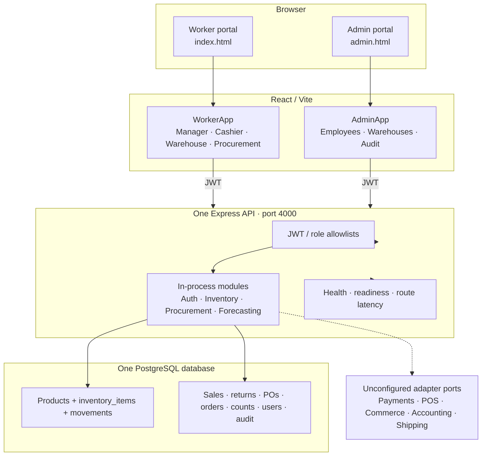
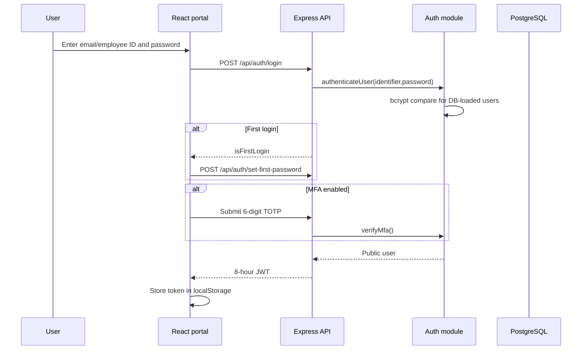
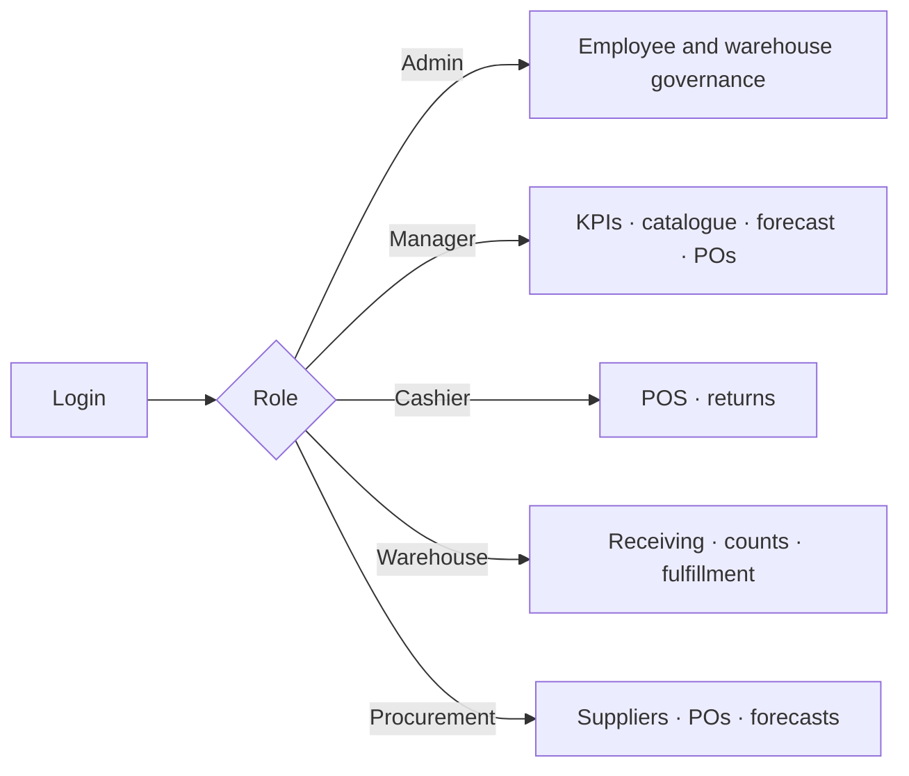
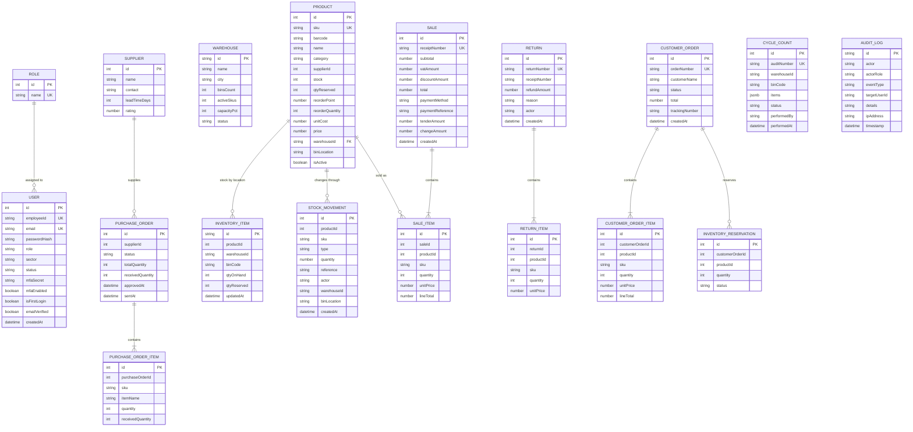

# SyncStock 2.0 — Inventory & Access Management Prototype

> **A dual-portal inventory operations prototype** built with Node.js · Express · TypeScript · React 18 · Vite · PostgreSQL.

SyncStock 2.0 provides dedicated workspaces for each operational role in a retail/logistics organisation: point-of-sale cashiers, stock-floor managers, warehouse receiving staff, procurement officers, and a completely separate administrative governance console for HR and facility management.

---

## Table of Contents

- [Project Background](#project-background)
- [Project Objectives](#project-objectives)
- [Implemented Scope and Design Status](#implemented-scope-and-design-status)
- [Project Documents](#project-documents)
- [Key Highlights](#key-highlights)
- [Current Runtime Architecture](#current-runtime-architecture)
- [Authentication & Security Flow](#authentication--security-flow)
- [Role Workspaces](#role-workspaces)
- [Purchase Order Lifecycle](#purchase-order-lifecycle)
- [Implemented Data Model](#implemented-data-model)
- [Current API Access Matrix](#current-api-access-matrix)
- [Feature Deep-Dive](#feature-deep-dive)
- [Technology Stack](#technology-stack)
- [Repository Structure](#repository-structure)
- [Quick Start](#quick-start)
- [Demo Access](#demo-access)
- [API Reference](#api-reference)
- [Testing & Quality Assurance](#testing--quality-assurance)
- [Environment Variables](#environment-variables)
- [Production Build](#production-build)

---

## Project Background

This project addresses inventory-management problems faced by small and medium-sized retailers. Manual counts, spreadsheets, and disconnected sales, warehouse, and supplier processes can produce inaccurate stock records, poor replenishment decisions, avoidable stockouts or overstock, and weak traceability. SyncStock explores how a shared, role-based application can connect these workflows and make inventory changes visible to the people responsible for them.

The repository contains both the working application prototype and the academic project materials. Market and financial figures in the problem statement are research-based context and projections; they are not measurements generated by this software.

## Project Objectives

- Maintain a shared product catalogue and record sales, returns, receiving, adjustments, and count discrepancies.
- Give cashiers, managers, warehouse staff, procurement staff, and administrators role-specific workflows and permissions.
- Support proactive replenishment through low-stock signals, demand estimates, supplier details, and purchase orders.
- Track reserved stock separately from available stock to support online-order fulfillment.
- Provide operational summaries and traceable stock and security records for review.

## Implemented Scope and Design Status

The current application is a functional prototype: a TypeScript Express API organized into domain modules, React/Vite worker and admin portals, and PostgreSQL persistence through Sequelize. Stock is represented by warehouse/bin inventory items with product-level aggregate totals. On startup, saved products, inventory items, users, sales, stock movements, purchase orders, online orders, and cycle counts are restored from PostgreSQL; production startup refuses to continue if PostgreSQL is unavailable.

Demand forecasting fits a simple linear regression to up to 730 days of daily stock movements, with historical-average and fallback behavior for sparse data. Seasonal and promotion multipliers can be supplied through a forecast-context provider, but no calendar or market-data provider is configured. Card and QR sales require a provider authorization; no payment provider is configured by default, so those methods fail closed. Provider-neutral contracts exist for payment, POS, commerce, accounting, and shipping integrations, but no vendor adapters are active.

The project specifications also describe separately deployed microservices, database-per-service, an API gateway, a distributed message bus/saga, external system integrations, and cloud-scale availability/recovery targets. Those remain target architecture, not claims about this modular application. The repository provides request p95 metrics and readiness checks, but no HA deployment, backup/replication policy, CI/CD, centralized monitoring, or verified SLOs. A single EC2 demo is deployed separately; this repository does not include its production infrastructure automation.

| Area | Implemented | Still target / limitation |
| :--- | :--- | :--- |
| Role workflows | Admin, Manager, Cashier, Warehouse, and Procurement portal workflows with route-level authorization | Some actual allowlists differ from the original role matrix; see the access notes below |
| Inventory | Product catalogue, per-warehouse/bin stock, aggregate availability, movements, reservations, receiving, cycle counts | No transfer workflow or database-enforced foreign keys/locking across service replicas |
| Persistence | PostgreSQL models, transaction writes, startup hydration for products, bins, users, sales, movements, POs, online orders, and counts | Development/test can fall back to memory; returns and some seed/reference collections are not fully restored |
| Forecasting | Simple linear regression fitted to up to 730 daily sales buckets, with sparse-history fallback and injectable promotion/seasonality multipliers | No configured promotion calendar, market data, external training pipeline, or validated ML accuracy |
| Payments and integrations | Provider interfaces; Card/QR and electronic refunds fail closed without provider approval | No active payment, POS, commerce, accounting, or shipping vendor adapter |
| Architecture | Modular monolith, one Express process and one PostgreSQL database | No deployed microservices, API gateway, broker, distributed saga, or database-per-service |
| Operations | Health/readiness endpoints, in-memory per-route average/p95/error metrics, production DB fail-fast | No measured SLO, HA, backups/replication, centralized telemetry, CI/CD, Kubernetes, or infrastructure-as-code |

## Project Documents

- [GitHub repository](https://github.com/sibbsagentmathonsi-hash/NPRT630) contains the project source.
- [Repository overview](../README.md) summarizes the full project and its published contents.
- [Problem statement](../Documents/PROJECT%20PROBLEM%20STATEMEN1.docx) covers the SME inventory problem, causes, business impact, and proposed value.
- [Development plan](../Documents/Inventory%20System%20Development%20Plan.docx) documents user workflows, interface design, usability feedback, data entities, and requirements.
- [System design specification](../Documents/System%20Design%20Specification.docx) presents the proposed architecture, functional and quality requirements, and process models.
- [Implementation roadmap](../Implementation%20Roadmap.md) stages the work from the core MVP through later integration and deployment goals.
- [Demo video](../Demo/Demo.md) links to the project demonstration.

## Key Highlights

| Feature | Detail |
| :--- | :--- |
| **Dual-Portal Architecture** | Worker Operations Portal + Admin Governance Console — completely separated HTML entry points and JWT namespaces |
| **Strict RBAC** | Five distinct roles; Admin is intentionally isolated from operational permission hierarchy |
| **Real TOTP MFA** | RFC 6238 Time-based OTP via `otplib` — QR URI generation, enrollment, and verification |
| **PostgreSQL Persistence** | Sequelize ORM; multi-bin stock, transaction records, users, orders, and counts hydrate on startup |
| **Demand Forecasting** | Trained linear regression over daily sales history with injectable promotion/seasonality factors |
| **Electronic Payments** | Card/QR require full provider authorization; unsupported methods are rejected rather than marked paid |
| **Operational Readiness** | Health/readiness endpoints and admin-only per-route average/p95 latency metrics |
| **Automated Test Coverage** | Native Node.js test runner covering inventory, authentication, procurement, forecasting, and API behavior |
| **Professional Brand Identity** | Dual-variant SVG vector logo (`BrandLogo.jsx`) — inventory cube (worker) / shield crest (admin) |
| **Dark Mode** | Full light/dark design system via CSS custom properties |

---

## Current Runtime Architecture



This is a modular monolith: one Express process, in-process domain modules, and one PostgreSQL database. Redis is included in Compose but unused by application code. There is no API gateway, independent service deployment, database-per-service, message broker, or distributed saga.

## Authentication & Security Flow



In development/test memory fallback, seeded passwords are plaintext. Production does not seed demo users; a new production database requires `ADMIN_EMAIL` and `ADMIN_PASSWORD` and forces the configured admin through first-login password setup. Existing databases from earlier versions must have any seeded demo accounts removed or rotated before deployment. First-password setup requires the employee's authenticated first-login token and cannot be reused after activation. Email verification codes are logged by the backend, and audit IP addresses currently use a loopback placeholder. Demo account discovery and unauthenticated quick-switch are disabled in production. CORS allows only the configured `CORS_ORIGINS` list (localhost Vite origins by default outside production); configure the deployed frontend origin explicitly and configure TLS at a trusted reverse proxy. The prototype is not production-ready for real user data.

## Role Workspaces



The UI separates Admin and worker entry points, but route authorization is defined independently for each API endpoint. See the current API access matrix above; several allowlists intentionally differ from the governance-only target described in the academic specification.

---

## Purchase Order Lifecycle

```mermaid
stateDiagram-v2
    [*] --> DRAFT: createPurchaseOrder()

    DRAFT --> APPROVED: approvePurchaseOrder()\n[Manager or Procurement]
    DRAFT --> CANCELLED: cancelPurchaseOrder()

    APPROVED --> SENT: sendPurchaseOrder()\n[updates local status; no supplier notification]
    APPROVED --> CANCELLED: cancelPurchaseOrder()

    SENT --> PARTIALLY_RECEIVED: receivePurchaseOrder()\n[qty < ordered]
    SENT --> RECEIVED: receivePurchaseOrder()\n[qty == ordered]
    SENT --> CANCELLED: cancelPurchaseOrder()

    PARTIALLY_RECEIVED --> RECEIVED: receivePurchaseOrder()\n[remaining qty fulfilled]
    PARTIALLY_RECEIVED --> CANCELLED: cancelPurchaseOrder()

    RECEIVED --> [*]
    CANCELLED --> [*]
```



---

## Implemented Data Model



`products.stock` and `products.qtyReserved` are aggregate compatibility fields; per-location quantities live in `inventory_items`. The Sequelize models do not declare every logical relation above as a database foreign key. `cycle_counts.items` is stored as JSONB, and audit logs are insert-only through the application (not protected from direct database edits by a trigger).

---

## Current API Access Matrix

| Capability | Admin | Manager | Cashier | Warehouse | Procurement |
| :--- | :---: | :---: | :---: | :---: | :---: |
| Employee provisioning & deletion | ✅ | ❌ | ❌ | ❌ | ❌ |
| Password & MFA resets | ✅ | ❌ | ❌ | ❌ | ❌ |
| Warehouse CRUD | ✅ | ❌ | ❌ | ❌ | ❌ |
| Security audit log access | ✅ | ❌ | ❌ | ❌ | ❌ |
| Product catalogue read | ✅ | ✅ | ✅ | ✅ | ✅ |
| Create/edit products | ✅ | ✅ | ❌ | ❌ | ✅ |
| POS checkout | ❌ | ✅ | ✅ | ❌ | ❌ |
| Product returns | ❌ | ✅ | ✅ | ❌ | ❌ |
| Create purchase orders | ❌ | ✅ | ❌ | ❌ | ✅ |
| Approve/send/cancel purchase orders | ❌ | ✅ | ❌ | ❌ | ✅ |
| Stock receiving | ❌ | ✅ | ❌ | ✅ | ❌ |
| Cycle count audits | ❌ | ✅ | ❌ | ✅ | ❌ |
| Online order reservation | ❌ | ✅ | ✅ | ❌ | ❌ |
| Commit/release online orders | ❌ | ✅ | ✅ | ✅ | ❌ |
| Demand forecasting view | ✅ | ✅ | ❌ | ❌ | ✅ |
| KPI dashboard | ❌ | ✅ | ❌ | ❌ | ❌ |

> [!NOTE]
> This table reflects the route allowlists in `server.ts`, not the original target policy. In particular, Admin can create/edit products, Procurement can approve/send/cancel purchase orders, and Managers can receive stock and submit cycle counts. Review these permissions before production use.

---

## Feature Deep-Dive

### 🛒 Cashier Workspace

| Feature | Detail |
| :--- | :--- |
| **Barcode / SKU scanner** | Input field accepts physical scanner output or manual entry; matches by barcode string or SKU (case-insensitive) and adds item to cart instantly |
| **Live stock guard** | Adding or incrementing an item beyond its available stock triggers a real-time error — the cart cannot exceed what is physically on hand |
| **Tender & change calculation** | Cash tender amount input; change-due auto-calculated and displayed before checkout confirmation |
| **Payment methods** | Cash is validated against the total; Card/QR are accepted only when a configured provider authorizes the full amount (no provider is configured by default) |
| **South African VAT (15%)** | VAT is extracted from the inclusive price using the formula `total × 15 / 115`, not added on top — correct for SA tax law |
| **Percentage discount** | Discount slider/input applied before VAT extraction; supports 0–100% |
| **Printed receipt** | On successful sale, a formatted receipt is generated in-app with receipt number, line items, VAT breakdown, payment method, cashier ID, and timestamp |
| **Receipt-based returns** | Cashier enters receipt number to look up the original sale; system pre-fills the product, and upon confirmation restores stock and logs a refund movement |
| **Return reason codes** | Structured reason picker: Damaged Product, Expired Item, Defective Goods, Wrong Item/Size, Customer Changed Mind, Packaging Compromised |
| **Receipts history tab** | Third tab shows a paginated list of past sale receipts for the current session |
| **Category filter** | Product grid can be filtered by category tab to speed up item lookup |

---

### 📊 Manager Workspace

| Feature | Detail |
| :--- | :--- |
| **KPI Dashboard** | Live tiles: daily sales revenue, stock-on-hand count, available vs reserved units, inventory cost value, inventory retail value, gross margin %, low-stock count |
| **Product catalogue management** | Managers can create new products and edit existing ones via a full product form (SKU, barcode, name, category, supplier, cost price, retail price, reorder point, reorder quantity, warehouse, bin location, image URL) |
| **Catalogue search & filter** | Full-text search by product name, SKU, or barcode; combined with category tab filter |
| **One-click replenishment PO** | From the forecasting view, a high-risk SKU can prefill a draft PO using the supplier, current stock, and configured reorder quantity; this is not an EOQ model |
| **Bulk low-stock PO generation** | Single button generates draft purchase orders for all SKUs currently below reorder point — skips any SKU that already has an open draft PO |
| **Supplier performance ratings** | Supplier list shows on-time delivery rate and quality score alongside contact details |
| **Purchase order approval flow** | Manager and Procurement API roles can approve (DRAFT → APPROVED), send (APPROVED → SENT), or cancel open orders |
| **Forecasting sub-tabs** | Workspace has four tabs: Overview (KPIs), Forecasting (risk table), Suppliers, and Catalogue |

---

### 🏭 Warehouse Workspace

| Feature | Detail |
| :--- | :--- |
| **Goods receiving** | Operator selects an open purchase order and enters quantity and destination warehouse/bin — stock is incremented and a movement is created. Condition and notes controls are currently not sent to the API |
| **Partial receipt support** | If received quantity is less than ordered, PO status moves to PARTIALLY_RECEIVED; remaining quantity is tracked for follow-up receipts |
| **Cycle count auditing** | Warehouse/bin selector; auditor steps through each product with +/− quantity steppers; submission reconciles only the selected bin and stores a cycle-count record plus stock movement |
| **Stock adjustment** | ADD/DEDUCT writes an audited adjustment to the product's primary warehouse/bin. Deductions are rejected if they exceed unreserved stock. Inter-warehouse transfers are not implemented; use the PO receiving workflow for supplier receipts |
| **Online order fulfilment** | Picker commits a reservation, which deducts physical stock and marks the order `PAID`, or releases it back to available if cancelled |
| **Mobile scanner simulation mode** | Toggle switches the UI into a compact, touch-friendly scanner simulation layout suited for handheld devices |
| **Four workspace tabs** | Receiving, Cycle Count, Stock Adjustments, Order Fulfilment |

---

### 🔐 Admin Governance Portal

| Feature | Detail |
| :--- | :--- |
| **Employee registration modal** | Full form: name, email, sector (Store Management / Cashier & Front-of-House / Warehouse & Logistics / Procurement & Supply Chain / System Administration), role, temporary password |
| **Employee search & sector filter** | Search by name/email combined with sector dropdown filter |
| **Inline employee edit** | Click Edit on any employee row to update their name, email, sector, role, or status in-place |
| **Force password reset** | One-click action sets `isFirstLogin` and a temporary password — the employee must set a new password on next login |
| **MFA revocation** | Admin can revoke an employee's TOTP secret; they can re-enroll on next login |
| **Account removal** | The delete action removes the employee row from the database; it is not a soft-delete. Use status changes when an account should be retained |
| **Security audit log** | Security events are inserted into PostgreSQL and displayed with actor, description, status, and timestamp. The application writes insert-only; the database has no trigger preventing direct SQL updates/deletes, and the recorded IP is currently a loopback placeholder |
| **Warehouse facility management** | Create, edit, and delete warehouse records with ID, name, city, bin count, active SKUs, capacity %, supervisor assignment, and operational status (OPERATIONAL / STANDBY / MAINTENANCE) |
| **Operational oversight** | Admin can view products, suppliers, purchase orders, and forecasts. Current API allowlists also permit Admin product create/update; see the access matrix caveat |
| **Policies tab** | Displays the system's access control and security policies in human-readable format |
| **Session expiry detection** | On any 401 response, the portal auto-clears the session and returns to the login screen |

---

### 🔑 Authentication System

| Feature | Detail |
| :--- | :--- |
| **Dual-identifier login** | Accepts email address, Employee ID (`EMP-XXX-NNN`), or generic `identifier` field — any format works |
| **First-login password wizard** | New accounts use the `isFirstLogin` flag; a multi-step wizard enforces password-strength rules before granting access |
| **Password strength rules** | Minimum 8 characters, at least one uppercase, one lowercase, one digit, one symbol — validated client and server side |
| **Email OTP verification** | A 6-digit code can be sent through optional SMTP and expires after 10 minutes. Codes are also written to backend logs; outstanding verification codes are held in process memory |
| **TOTP MFA enrollment** | On enrollment, server generates a random secret, returns a QR-compatible URI (`otpauth://`), and the user scans it with any authenticator app |
| **TOTP verification** | Every login with MFA enrolled requires a valid 6-digit TOTP code (30-second window, RFC 6238) verified server-side with `otplib` |
| **JWT session tokens** | 8-hour expiry; signed with `JWT_SECRET`; includes user ID, role, employeeId, name; browser tokens are stored in `localStorage` |
| **Separate JWT namespaces** | Worker portal stores token in `syncstock_worker_token`; Admin portal in `syncstock_admin_token` — cross-portal token reuse is rejected |

---


## Technology Stack

| Layer | Technology | Version |
| :--- | :--- | :--- |
| **Frontend Runtime** | React | 18 |
| **Frontend Build** | Vite (multi-page) | 5 |
| **UI Styling** | Modern CSS custom properties (light/dark) | — |
| **Backend Runtime** | Node.js | v24 |
| **Backend Framework** | Express | 4 |
| **Backend Language** | TypeScript | 5 |
| **Database** | PostgreSQL | 16 |
| **ORM** | Sequelize | 6 |
| **Regression model** | `ml-regression` | 6 |
| **Authentication** | JWT (`jsonwebtoken`) | — |
| **Password Hashing** | bcryptjs | — |
| **TOTP MFA** | otplib | — |
| **Email OTP** | nodemailer | — |
| **Testing** | Node.js native test runner | v24 built-in |

---

## Repository Structure

```text
.
├── backend/
│   ├── src/
│   │   ├── config/                  # Sequelize and PostgreSQL startup/hydration
│   │   ├── models/                  # Product, stock movement, domain ORM models
│   │   ├── modules/
│   │   │   ├── auth/                # Users, JWT, TOTP, email OTP, RBAC
│   │   │   ├── forecasting/         # Regression model and reorder calculations
│   │   │   ├── integrations/        # Provider-neutral payment/external-system ports
│   │   │   └── procurement/         # POs, receiving state, supplier ratings
│   │   ├── inventory.ts             # Stock, bins, sales, returns, orders, counts
│   │   ├── observability.ts         # In-memory per-route latency/error metrics
│   │   ├── persistence.ts           # PostgreSQL writes and transactions
│   │   ├── server.ts                # Express REST API
│   │   └── *.test.ts                # Domain, integration-port, and metrics tests
│   ├── .env.example
│   ├── package.json
│   └── tsconfig.json
├── frontend/
│   ├── src/
│   │   ├── apps/
│   │   │   ├── AdminApp.jsx         # Admin governance console
│   │   │   └── WorkerApp.jsx        # Operations console
│   │   ├── components/
│   │   │   ├── admin/               # AdminPortal, employee mgmt, warehouse CRUD
│   │   │   ├── auth/                # WorkerAuthModal, OTP, password wizard
│   │   │   ├── cashier/             # CashierWorkspace (POS, returns)
│   │   │   ├── common/              # BrandLogo.jsx, icons, status pills
│   │   │   ├── manager/             # ManagerWorkspace (KPIs, forecasts, POs)
│   │   │   └── warehouse/           # WarehouseWorkspace (receiving, cycle counts)
│   │   ├── styles.css               # Design system (light & dark mode)
│   │   ├── admin.html               # Admin portal entry point
│   │   └── index.html               # Worker operations entry point
│   ├── package.json
│   └── vite.config.js
├── docker-compose.yml
├── package.json                     # Workspace orchestration (dev and build)
└── README.md
```

---

## Quick Start

### 1. Prerequisites

- **Node.js**: v18 or later (tested on v24)
- **PostgreSQL**: running on `localhost:5432` — or launch via Docker Compose:

```powershell
docker-compose up -d
```

### 2. Install Dependencies

```powershell
npm.cmd install
```

### 3. Configure Environment

Copy the example file and fill in your database credentials:

```powershell
Copy-Item backend\.env.example backend\.env
```

For the included local Compose database, set `DB_HOST=localhost`, `DB_PORT=5432`, `DB_USER=postgres`, `DB_PASSWORD=postgres`, and `DB_NAME=inventory_db`. Replace the placeholder `JWT_SECRET` with a long random value. The Compose password is for local development only. The Redis container is currently unused by the application.

### 4. Start Development Servers

```powershell
npm.cmd run dev
```

Both the backend API and the Vite dev server start concurrently:

| Service | URL |
| :--- | :--- |
| Backend API | `http://localhost:4000` |
| Worker Operations Portal | `http://localhost:5175` |
| Admin Governance Portal | `http://localhost:5175/admin.html` |
| Health Check | `http://localhost:4000/api/health` |

> [!TIP]
> On Windows PowerShell, always use `npm.cmd` instead of `npm` to ensure npm scripts execute correctly.

---

## Demo Access

### System Administrator

> [!CAUTION]
> Non-production builds include a demo administrator (`EMP-ADM-001`) in `backend/src/modules/auth/auth.ts`. Production does not seed demo users: for a new production database, set `ADMIN_EMAIL` and a strong `ADMIN_PASSWORD` before first start; the first login requires choosing a new password. The admin bootstrap settings are only used when the production database has no users.

Admin portal: `http://localhost:5175/admin.html`.

The Administrator can create all other staff accounts (Managers, Cashiers, Warehouse Staff, Procurement Officers) directly within the Admin Portal. Each account receives a sector-prefixed Employee ID automatically:

| Role | Employee ID Prefix | Example |
| :--- | :--- | :--- |
| Administrator | `EMP-ADM-` | `EMP-ADM-001` |
| Manager | `EMP-MGR-` | `EMP-MGR-001` |
| Cashier | `EMP-CSH-` | `EMP-CSH-001` |
| Warehouse Staff | `EMP-WRH-` | `EMP-WRH-001` |
| Procurement Staff | `EMP-PRC-` | `EMP-PRC-001` |

---

## API Reference

All routes are served by the Express API on port `4000`. Authorization is enforced by route allowlists; there is no generated OpenAPI specification.

### Health and Metrics

| Method | Endpoint | Auth | Description |
| :--- | :--- | :--- | :--- |
| `GET` | `/api/health` | None | Liveness status and process uptime |
| `GET` | `/api/health/ready` | None | Readiness and storage mode; production requires PostgreSQL |
| `GET` | `/api/admin/metrics` | Admin | Per-route counts, errors, average latency, p95 latency (in-memory sample window) |

### Authentication and Administration

| Method | Endpoint | Auth | Description |
| :--- | :--- | :--- | :--- |
| `GET` | `/api/auth/demo-accounts` | None, non-production only | List seeded demo accounts; returns 404 in production |
| `POST` | `/api/auth/login` | None | Authenticate by email, employee ID, or identifier |
| `POST` | `/api/auth/set-first-password` | Authenticated first-login session | Set a first password once for the matching employee |
| `POST` | `/api/auth/mfa/enroll` | Authenticated staff | Create TOTP enrollment URI |
| `POST` | `/api/auth/verify-mfa` | None | Verify a TOTP code |
| `POST` | `/api/auth/quick-switch` | None, non-production only | Demo account switch; returns 404 in production |
| `POST` | `/api/auth/send-verification-code` | None | Send/simulate email verification code |
| `POST` | `/api/auth/verify-email-code` | None | Verify email code |
| `POST` | `/api/admin/employees` | Admin | Register employee |
| `GET` | `/api/admin/employees` | Admin | List employees |
| `PATCH` | `/api/admin/employees/:id` | Admin | Update employee role, sector, or status |
| `DELETE` | `/api/admin/employees/:id` | Admin | Remove employee |
| `POST` | `/api/admin/employees/:id/reset-password` | Admin | Force password setup |
| `POST` | `/api/admin/employees/:id/reset-mfa` | Admin | Reset MFA enrollment |
| `GET` | `/api/admin/audit-logs` | Admin | Read security events |
| `GET` | `/api/admin/warehouses` | Admin | List warehouses |
| `POST` | `/api/admin/warehouses` | Admin | Create warehouse |
| `PATCH` | `/api/admin/warehouses/:id` | Admin | Update warehouse |
| `DELETE` | `/api/admin/warehouses/:id` | Admin | Delete warehouse |

### Inventory, Sales, and Receiving

| Method | Endpoint | Auth | Description |
| :--- | :--- | :--- | :--- |
| `GET` | `/api/products` | All roles | List products |
| `POST` | `/api/products` | Admin, Manager, Procurement | Create product |
| `PATCH` | `/api/products/:id` | Admin, Manager, Procurement | Update product |
| `GET` | `/api/products/low-stock` | Manager, Warehouse | List low-stock products |
| `GET` | `/api/stock-movements` | Manager, Cashier, Warehouse | List stock movements |
| `GET` | `/api/dashboard/summary` | Manager | Read operational KPIs |
| `GET` | `/api/inventory/workspace` | Manager, Cashier, Warehouse, Procurement | Role-scoped workspace data |
| `GET` | `/api/inventory/items?productId=:id` | Admin, Manager, Warehouse, Procurement | Read stock by warehouse/bin |
| `POST` | `/api/inventory/adjustments` | Manager, Warehouse | Add/deduct stock at the product's primary bin; prevents deductions below reserved quantity |
| `POST` | `/api/sales` | Manager, Cashier | Checkout; cash must cover total, Card/QR require provider authorization |
| `GET` | `/api/sales/receipts` | Manager, Cashier | List receipts |
| `POST` | `/api/returns` | Manager, Cashier | Process return; electronic receipts require provider refund |
| `POST` | `/api/receiving` | Manager, Warehouse | Receive stock into a warehouse/bin |
| `GET` | `/api/cycle-counts` | Manager, Warehouse | List cycle counts |
| `POST` | `/api/cycle-counts` | Manager, Warehouse | Reconcile a warehouse/bin count |

### Procurement, Forecasting, and Online Orders

| Method | Endpoint | Auth | Description |
| :--- | :--- | :--- | :--- |
| `GET` | `/api/suppliers` | Admin, Manager, Warehouse, Procurement | List suppliers |
| `GET` | `/api/supplier-performance` | Admin, Manager, Procurement | Supplier metrics |
| `GET` | `/api/purchase-orders` | Admin, Manager, Warehouse, Procurement | List purchase orders |
| `POST` | `/api/purchase-orders` | Manager, Procurement | Create purchase order |
| `POST` | `/api/purchase-orders/generate-low-stock` | Manager, Procurement | Generate draft low-stock orders |
| `PATCH` | `/api/purchase-orders/:id/approve` | Manager, Procurement | Approve a draft order |
| `PATCH` | `/api/purchase-orders/:id/send` | Manager, Procurement | Mark an order sent |
| `PATCH` | `/api/purchase-orders/:id/cancel` | Manager, Procurement | Cancel an open order |
| `PATCH` | `/api/purchase-orders/:id/receive` | Manager, Warehouse | Receive into a selected bin |
| `GET` | `/api/forecast` | Admin, Manager, Procurement | List demand forecasts |
| `GET` | `/api/forecast/:sku` | Admin, Manager, Procurement | Forecast a SKU |
| `GET` | `/api/orders` | Manager, Cashier, Warehouse | List online orders |
| `POST` | `/api/orders/reserve` | Manager, Cashier | Reserve order stock |
| `PATCH` | `/api/orders/:id/commit` | Manager, Cashier, Warehouse | Commit reservation |
| `PATCH` | `/api/orders/:id/release` | Manager, Cashier, Warehouse | Release reservation |

These are the implemented routes; there are no separate `/api/admin/products`, `/api/admin/suppliers`, `/api/admin/purchase-orders`, or `/api/admin/forecast` aliases. Admin uses the shared endpoints where authorized. Demo account discovery and the unauthenticated `quick-switch` route are available only outside production; neither can issue or disclose demo sessions in production.

---

## Testing & Quality Assurance

Run the complete automated test suite:

```powershell
npm.cmd run test --workspace backend
```

### Test Suite Summary

| Suite | File | Coverage Areas |
| :--- | :--- | :--- |
| **Inventory Core** | `inventory.test.ts` | Sales (VAT, discount), returns, stock receiving, cycle counts, reservations, valuation metrics, low-stock detection, dashboard KPIs |
| **Procurement** | `procurement.test.ts` | PO creation, approval, dispatch, partial and full receiving, cancellation, low-stock PO generation, supplier ratings |
| **Forecasting** | `forecasting.test.ts` | Regression training, sparse-history fallback, promotion/seasonality factors, reorder point, and stockout risk |
| **Auth & Security** | `auth.test.ts` | Password policy, employee IDs, JWT verification, role permissions, TOTP MFA, and email OTP |
| **Provider contracts** | `integrations.test.ts` | Default-deny payment authorization/refunds and full-amount validation |
| **Observability** | `observability.test.ts` | Per-route request/error counts and average/p95 calculation |

> [!IMPORTANT]
> The automated tests run with `NODE_ENV=test` and do not connect to PostgreSQL. `backend/src/server.test.ts` is currently empty, so API route and database migration behavior are not covered by a committed integration suite. The frontend has no test or lint script; use the root build to verify its bundle.

---

## Environment Variables

Configure `backend/.env` (copy from `backend/.env.example`):

| Variable | Default | Purpose |
| :--- | :--- | :--- |
| `PORT` | `4000` | HTTP port for Express API |
| `NODE_ENV` | `development` | Runtime mode (`development` · `test` · `production`) |
| `DB_HOST` | `localhost` | PostgreSQL host |
| `DB_PORT` | `5432` | PostgreSQL port |
| `DB_USER` | `postgres` | Database user |
| `DB_PASSWORD` | *(required)* | Database password |
| `DB_NAME` | `inventory_db` | PostgreSQL schema / database name |
| `JWT_SECRET` | *(required)* | HMAC-SHA256 signing key for session tokens |
| `CORS_ORIGINS` | Local Vite origins in the example; empty if unset in production | Comma-separated browser origins allowed to call the API; set the deployed frontend origin in production |
| `ADMIN_NAME` | `System Administrator` | Optional display name for first production admin bootstrap |
| `ADMIN_EMAIL` | *(required for a new production database)* | Email for the initial production administrator |
| `ADMIN_PASSWORD` | *(required for a new production database)* | Strong one-time password for initial administrator setup |
| `SMTP_HOST` | *(optional)* | SMTP relay for email OTP delivery |
| `SMTP_PORT` | `587` | SMTP relay port |
| `SMTP_SECURE` | `false` | Use TLS for SMTP connection |
| `SMTP_USER` | *(optional)* | SMTP username |
| `SMTP_PASSWORD` | *(optional)* | SMTP password |
| `SMTP_FROM` | `SMTP_USER` | Sender address for verification email |

> [!CAUTION]
> Never commit `backend/.env` to version control. It is listed in `.gitignore`. Use `backend/.env.example` as the template — it contains only placeholder values.
> The backend will not start without `DB_PASSWORD` and `JWT_SECRET`; provide unique values through `backend/.env` or the deployment environment. A new production database also requires `ADMIN_EMAIL` and `ADMIN_PASSWORD`. Set `CORS_ORIGINS` to the exact frontend origin(s) in production.

---

## Production Build

Compile TypeScript and generate optimised Vite bundles:

```powershell
npm.cmd run build
```

Outputs:
- `backend/dist/` — CommonJS bundle (Node.js)
- `frontend/dist/` — Vite multi-page bundle (`index.html` + `admin.html`, chunked JS/CSS)

Start the compiled API with `npm.cmd start` after configuring `NODE_ENV=production` and PostgreSQL. Production startup exits rather than serving from memory when PostgreSQL is unavailable. The repository does not include a static-file server/reverse proxy, TLS configuration, process manager, migration runner, cloud infrastructure definitions, or deployment workflow; those must be supplied by the deployment environment. The included Compose file starts only PostgreSQL and Redis, not the application.

---

## License

Academic project — NPRG631. All rights reserved.
