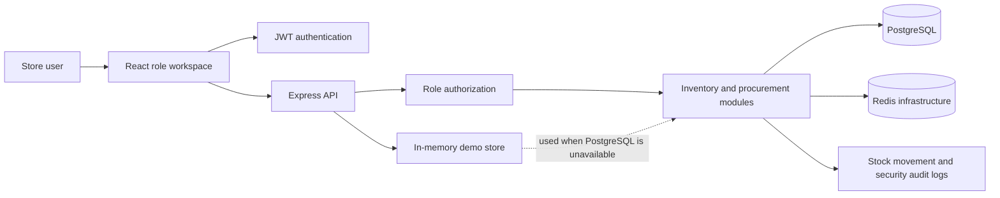
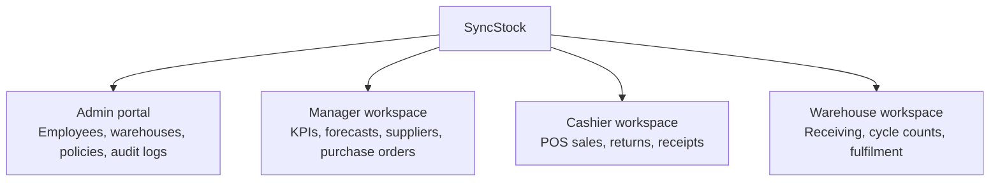
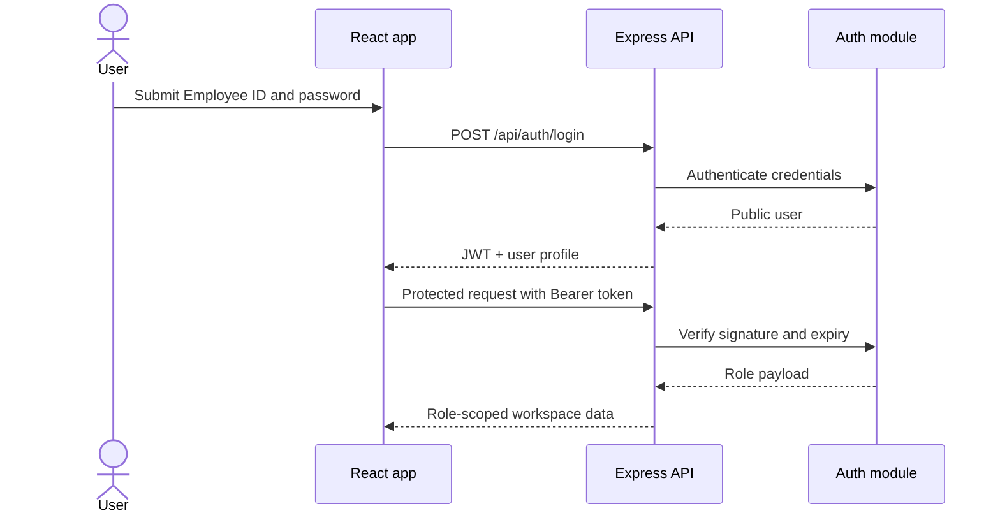
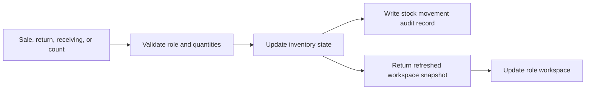
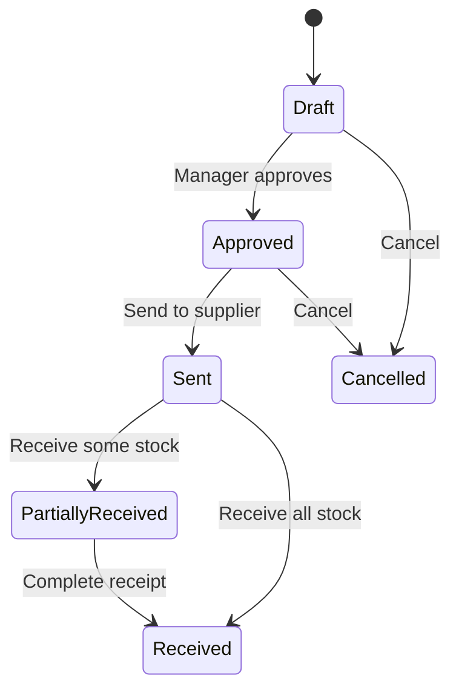

# Cloud-Native Inventory Management System

A full-stack inventory management demo for small and medium-sized retail businesses. The application combines role-based workspaces for store managers, cashiers, warehouse staff, and administrators with an Express API and PostgreSQL-backed inventory data.

## Features

- Role-based authentication for administrators, managers, cashiers, and warehouse staff
- Product catalogue with SKU, barcode, supplier, bin, pricing, reorder levels, and availability
- Inventory dashboard with sales, stock value, low-stock alerts, reserved units, and movement history
- Cashier sales and returns with stock validation and audit movements
- Warehouse receiving, cycle counts, and stock adjustments
- Purchase order creation, approval, sending, cancellation, and receiving
- Demand forecasting based on recent sales, supplier lead time, and safety stock
- Online order reservation, fulfilment, and release workflows
- PostgreSQL persistence with an in-memory fallback for demonstrations
- Docker Compose configuration for PostgreSQL and Redis

## Technology

| Area | Technology |
| --- | --- |
| Frontend | React 18, Vite |
| Backend | Node.js, Express, TypeScript |
| Persistence | PostgreSQL, Sequelize |
| Caching infrastructure | Redis |
| Authentication | JWT, bcryptjs |
| Testing | Node.js test runner, ts-node |

## Repository layout

```text
.
├── backend/       Express API, domain modules, models, and tests
├── frontend/      React applications and role-based workspaces
├── docker-compose.yml
├── package.json   Workspace scripts
└── README.md
```

## Product snapshots

These diagrams provide a quick visual snapshot of how the application is structured and how a request moves through the system.

### System architecture



### Role workspace snapshot



### Access matrix

| Workspace capability | Admin | Manager | Cashier | Warehouse |
| --- | :---: | :---: | :---: | :---: |
| Manage employees and security policies | Yes | No | No | No |
| View operational dashboard | No | Yes | No | No |
| Create sales and returns | No | Yes | Yes | No |
| Receive stock and perform cycle counts | No | Yes | No | Yes |
| Approve and manage purchase orders | No | Yes | No | Receive only |
| Manage reserved online orders | No | Yes | Yes | Yes |

## How it works

### 1. Authentication and access control

1. A user signs in with an email address or Employee ID.
2. The backend validates the credentials and signs an 8-hour JWT.
3. The frontend stores the session locally and requests the role workspace.
4. Every protected API route checks the bearer token and role before continuing.
5. Expired or invalid admin sessions are cleared and returned to the login dialog.



### 2. Inventory synchronization

The workspace endpoint returns a role-scoped snapshot containing products, categories, summary metrics, low-stock items, receipts, movements, suppliers, forecasts, purchase orders, and reserved orders. After a mutation, the relevant endpoint returns updated data and the frontend refreshes the workspace.



### 3. Sales and returns

Cashiers search the product catalogue, add items to the basket, and submit a sale. The API validates every line before deducting stock, creates a receipt, calculates VAT, and records the movement. A return reverses the stock movement and keeps the original transaction context.

### 4. Receiving and cycle counts

Warehouse staff record received quantities against a purchase order or receiving reference. Cycle counts compare physical quantities with system quantities, reconcile differences, and create an auditable adjustment movement.

### 5. Procurement and forecasting

Managers review low-stock alerts and forecast output, then generate or create purchase orders. Orders move through creation, approval, sending, cancellation, and receiving states. Forecast recommendations use recent demand, supplier lead time, safety stock, and reorder thresholds.



### 6. Online order reservations

An online order first reserves available units so they cannot be oversold. The reservation can then be committed to fulfilment or released back into available stock. Each transition updates inventory availability and the movement trail.

## Prerequisites

- Node.js 18 or later
- npm 9 or later
- Docker Desktop, optional but recommended for PostgreSQL and Redis

## Quick start

Install the workspace dependencies:

```bash
npm install
```

Start PostgreSQL and Redis with Docker Compose:

```bash
docker compose up -d
```

Start the frontend and backend together:

```bash
npm run dev
```

The default URLs are:

- Frontend: http://localhost:5173
- API health check: http://localhost:4000/api/health

Vite automatically selects the next available port if port 5173 is already in use.

On Windows PowerShell, use `npm.cmd` instead of `npm` if script execution policy blocks the npm PowerShell shim:

```powershell
npm.cmd run dev
```

## Environment configuration

Copy `.env.example` to `.env` and adjust values when needed:

```bash
cp .env.example .env
```

The backend supports these variables:

| Variable | Default | Description |
| --- | --- | --- |
| `PORT` | `4000` | API port |
| `NODE_ENV` | `development` | Runtime environment |
| `DB_HOST` | `localhost` | PostgreSQL host |
| `DB_PORT` | `5432` | PostgreSQL port |
| `DB_USER` | `postgres` | PostgreSQL user |
| `DB_PASSWORD` | `M@th0nsi` | PostgreSQL password used by the backend when not overridden |
| `DB_NAME` | `inventory_db` | PostgreSQL database name |
| `JWT_SECRET` | development fallback | Secret used to sign authentication tokens |

For the supplied Docker Compose database, set `DB_PASSWORD=postgres` in `.env` so it matches the Compose configuration.

If PostgreSQL is unavailable, the API logs a warning and uses its in-memory demo store. This is convenient for evaluation, but it should not be used as a production persistence strategy.

## Demo accounts

| Role | Email | Password |
| --- | --- | --- |
| Administrator | `admin@retail.local` | `admin123` |
| Store Manager | `manager@retail.local` | `manager123` |
| Cashier | `cashier@retail.local` | `cashier123` |
| Warehouse Staff | `warehouse@retail.local` | `warehouse123` |

These credentials are for local demonstration only. Change all secrets and passwords before deploying the application.

## Useful commands

| Command | Description |
| --- | --- |
| `npm run dev` | Start frontend and backend development servers |
| `npm run dev:frontend` | Start only the frontend |
| `npm run dev:backend` | Start only the backend |
| `npm run build` | Build the backend and frontend |
| `npm run start` | Start the compiled backend |
| `npm test --workspace backend` | Run backend tests |
| `docker compose up -d` | Start local PostgreSQL and Redis |
| `docker compose down` | Stop local infrastructure |

## API overview

The API is served from `http://localhost:4000` by default. Important route groups include:

- `/api/health` - service health
- `/api/auth` - login, registration, verification, and session flows
- `/api/inventory` - inventory snapshots and dashboard data
- `/api/sales` - sales transactions and receipts
- `/api/returns` - product returns
- `/api/cycle-counts` - warehouse cycle counts
- `/api/suppliers` - supplier data
- `/api/purchase-orders` - procurement workflows
- `/api/forecasting` - demand forecasts
- `/api/orders` - reserved online orders

Most operational routes require a bearer token returned by the authentication endpoints.

## Production considerations

This repository is a demonstration foundation rather than a production deployment. Before production use, add managed database persistence and migrations, rotate secrets, enforce HTTPS, strengthen role permissions, add rate limiting and audit retention, configure external observability, and use a production-grade deployment pipeline.
