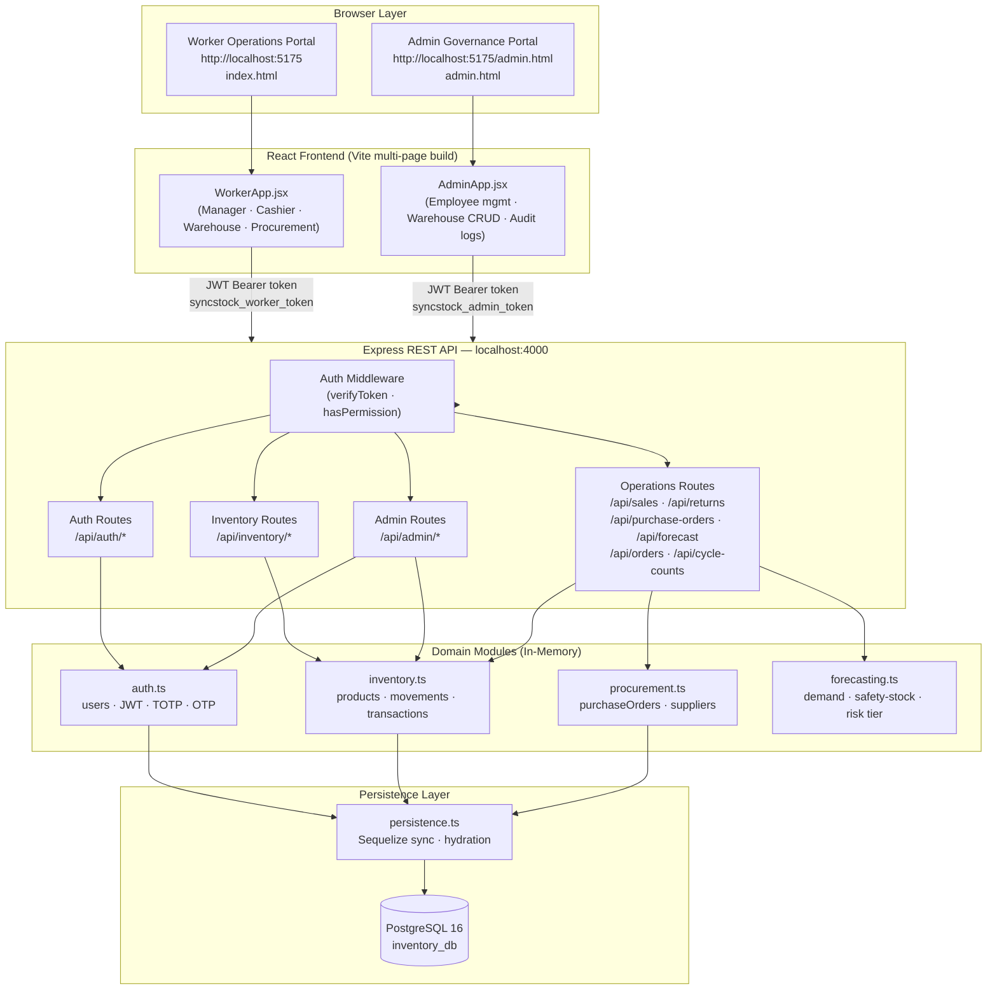
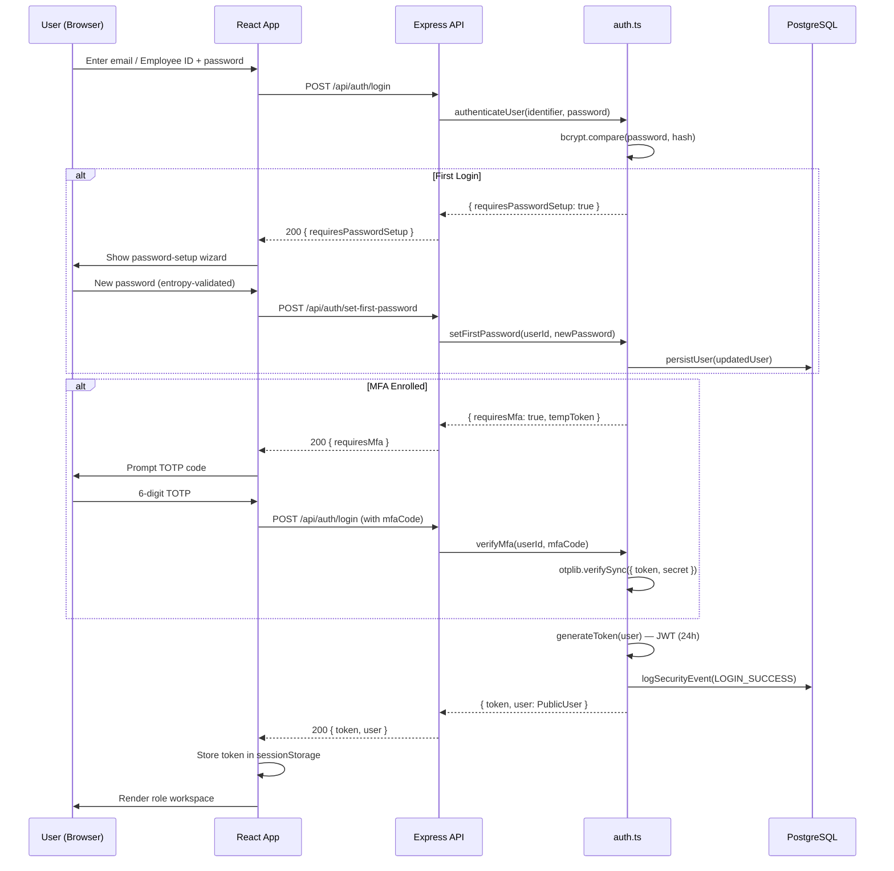
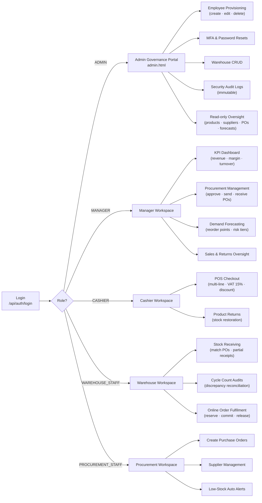
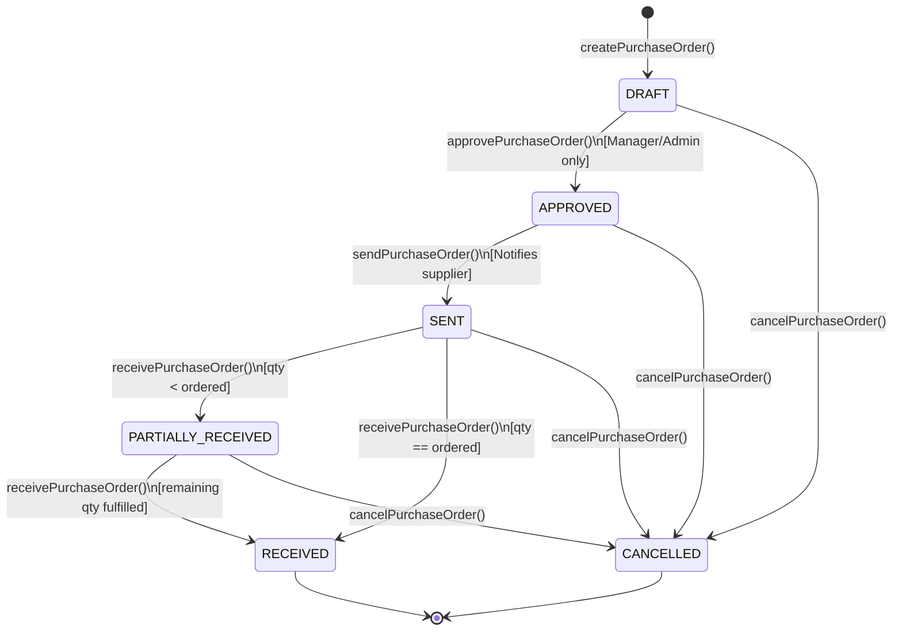
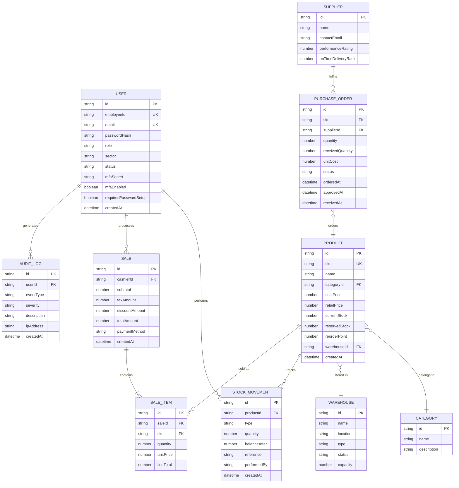

# SyncStock 2.0 — Cloud-Native Inventory & Access Management System

> **A dual-portal, role-isolated inventory governance platform** built with Node.js · Express · TypeScript · React 18 · Vite · PostgreSQL.

SyncStock 2.0 provides dedicated workspaces for each operational role in a retail/logistics organisation: point-of-sale cashiers, stock-floor managers, warehouse receiving staff, procurement officers, and a completely separate administrative governance console for HR and facility management.

---

## Table of Contents

1. [Key Highlights](#key-highlights)
2. [System Architecture](#system-architecture)
3. [Authentication & Security Flow](#authentication--security-flow)
4. [Role Workspaces](#role-workspaces)
5. [Purchase Order Lifecycle](#purchase-order-lifecycle)
6. [Data Model (ER Diagram)](#data-model-er-diagram)
7. [Role Access Matrix](#role-access-matrix)
8. [Technology Stack](#technology-stack)
9. [Repository Structure](#repository-structure)
10. [Quick Start](#quick-start)
11. [Credentials & Access](#credentials--access)
12. [API Reference](#api-reference)
13. [Testing & Quality Assurance](#testing--quality-assurance)
14. [Environment Variables](#environment-variables)
15. [Production Build](#production-build)

---

## Key Highlights

| Feature | Detail |
| :--- | :--- |
| **Dual-Portal Architecture** | Worker Operations Portal + Admin Governance Console — completely separated HTML entry points and JWT namespaces |
| **Strict RBAC** | Five distinct roles; Admin is intentionally isolated from operational permission hierarchy |
| **Real TOTP MFA** | RFC 6238 Time-based OTP via `otplib` — QR URI generation, enrollment, and verification |
| **PostgreSQL Persistence** | Sequelize ORM; catalogue hydration on startup ensures products survive server restarts |
| **60 / 60 Tests Passing** | Native Node.js test runner across 5 suites: inventory, auth, procurement, forecasting, API integration |
| **Professional Brand Identity** | Dual-variant SVG vector logo (`BrandLogo.jsx`) — inventory cube (worker) / shield crest (admin) |
| **Dark Mode** | Full light/dark design system via CSS custom properties |

---

## System Architecture



---

## Authentication & Security Flow



---

## Role Workspaces



---

## Purchase Order Lifecycle



---

## Data Model (ER Diagram)



---

## Role Access Matrix

| Capability | Admin | Manager | Cashier | Warehouse | Procurement |
| :--- | :---: | :---: | :---: | :---: | :---: |
| Employee provisioning & deletion | ✅ | ❌ | ❌ | ❌ | ❌ |
| Password & MFA resets | ✅ | ❌ | ❌ | ❌ | ❌ |
| Warehouse CRUD | ✅ | ❌ | ❌ | ❌ | ❌ |
| Security audit log access | ✅ | ❌ | ❌ | ❌ | ❌ |
| Product catalogue read | ✅ | ✅ | ✅ | ✅ | ✅ |
| POS checkout | ❌ | ✅ | ✅ | ❌ | ❌ |
| Product returns | ❌ | ✅ | ✅ | ❌ | ❌ |
| Approve purchase orders | ❌ | ✅ | ❌ | ❌ | ❌ |
| Create purchase orders | ❌ | ✅ | ❌ | ❌ | ✅ |
| Stock receiving (warehouse) | ❌ | ❌ | ❌ | ✅ | ❌ |
| Cycle count audits | ❌ | ❌ | ❌ | ✅ | ❌ |
| Online order reservation | ❌ | ✅ | ❌ | ✅ | ❌ |
| Demand forecasting view | ❌ | ✅ | ❌ | ❌ | ✅ |
| KPI dashboard | ❌ | ✅ | ❌ | ❌ | ❌ |

> [!NOTE]
> Admin is intentionally isolated from the operational permission hierarchy. `hasPermission('ADMIN', 'MANAGER')` returns `false` by design — Admin governs people and facilities, not merchandise transactions.

---

## Technology Stack

| Layer | Technology | Version |
| :--- | :--- | :--- |
| **Frontend Runtime** | React | 18 |
| **Frontend Build** | Vite (multi-page) | 5 |
| **UI Styling** | Modern CSS custom properties (light/dark) | — |
| **Backend Runtime** | Node.js | v24 |
| **Backend Framework** | Express | 4 |
| **Backend Language** | TypeScript | 5 |
| **Database** | PostgreSQL | 16 |
| **ORM** | Sequelize | 6 |
| **Authentication** | JWT (`jsonwebtoken`) | — |
| **Password Hashing** | bcryptjs | — |
| **TOTP MFA** | otplib | — |
| **Email OTP** | nodemailer | — |
| **Testing** | Node.js native test runner | v24 built-in |

---

## Repository Structure

```text
.
├── backend/
│   ├── src/
│   │   ├── config/
│   │   │   └── database.ts          # Sequelize connection setup
│   │   ├── models/
│   │   │   └── DomainModels.ts      # Sequelize model definitions
│   │   ├── modules/
│   │   │   ├── auth/
│   │   │   │   ├── auth.ts          # Users, JWT, TOTP, OTP, RBAC
│   │   │   │   └── auth.test.ts     # 11 auth & security tests
│   │   │   ├── forecasting/
│   │   │   │   ├── forecasting.ts   # Demand calc, safety stock, risk tiers
│   │   │   │   └── forecasting.test.ts  # 4 forecasting tests
│   │   │   └── procurement/
│   │   │       ├── procurement.ts   # Purchase order lifecycle, supplier ratings
│   │   │       └── procurement.test.ts  # 10 procurement tests
│   │   ├── inventory.ts             # In-memory catalogue, transactions, returns
│   │   ├── persistence.ts           # PostgreSQL sync & catalogue hydration
│   │   ├── server.ts                # Express REST API (938 lines)
│   │   ├── inventory.test.ts        # 23 inventory core tests
│   │   └── server.test.ts           # 12 REST API integration tests
│   ├── .env.example
│   ├── package.json
│   └── tsconfig.json
├── frontend/
│   ├── src/
│   │   ├── apps/
│   │   │   ├── AdminApp.jsx         # Admin governance console
│   │   │   └── WorkerApp.jsx        # Operations console
│   │   ├── components/
│   │   │   ├── admin/               # AdminPortal, employee mgmt, warehouse CRUD
│   │   │   ├── auth/                # WorkerAuthModal, OTP, password wizard
│   │   │   ├── cashier/             # CashierWorkspace (POS, returns)
│   │   │   ├── common/              # BrandLogo.jsx, icons, status pills
│   │   │   ├── manager/             # ManagerWorkspace (KPIs, forecasts, POs)
│   │   │   └── warehouse/           # WarehouseWorkspace (receiving, cycle counts)
│   │   ├── styles.css               # Design system (light & dark mode)
│   │   ├── admin.html               # Admin portal entry point
│   │   └── index.html               # Worker operations entry point
│   ├── package.json
│   └── vite.config.js
├── docker-compose.yml
├── package.json                     # Workspace orchestration (dev, build, test)
└── README.md
```

---

## Quick Start

### 1. Prerequisites

- **Node.js**: v18 or later (tested on v24)
- **PostgreSQL**: running on `localhost:5432` — or launch via Docker Compose:

```powershell
docker-compose up -d
```

### 2. Install Dependencies

```powershell
npm.cmd install
```

### 3. Configure Environment

Copy the example file and fill in your database credentials:

```powershell
Copy-Item backend\.env.example backend\.env
```

### 4. Start Development Servers

```powershell
npm.cmd run dev
```

Both the backend API and the Vite dev server start concurrently:

| Service | URL |
| :--- | :--- |
| Backend API | `http://localhost:4000` |
| Worker Operations Portal | `http://localhost:5175` |
| Admin Governance Portal | `http://localhost:5175/admin.html` |
| Health Check | `http://localhost:4000/api/health` |

> [!TIP]
> On Windows PowerShell, always use `npm.cmd` instead of `npm` to ensure npm scripts execute correctly.

---

## Credentials & Access

### System Administrator

> [!CAUTION]
> Admin credentials are **not** stored in this repository. Configure them via `backend/.env` before first run.

| Field | Value |
| :--- | :--- |
| Email | *(set via `ADMIN_EMAIL` in `backend/.env`)* |
| Employee ID | `EMP-ADM-001` |
| Password | *(set via `ADMIN_PASSWORD` in `backend/.env`)* |
| Portal | `http://localhost:5175/admin.html` |

The Administrator can create all other staff accounts (Managers, Cashiers, Warehouse Staff, Procurement Officers) directly within the Admin Portal. Each account receives a sector-prefixed Employee ID automatically:

| Role | Employee ID Prefix | Example |
| :--- | :--- | :--- |
| Administrator | `EMP-ADM-` | `EMP-ADM-001` |
| Manager | `EMP-MGR-` | `EMP-MGR-001` |
| Cashier | `EMP-CSH-` | `EMP-CSH-001` |
| Warehouse Staff | `EMP-WRH-` | `EMP-WRH-001` |
| Procurement Staff | `EMP-PRC-` | `EMP-PRC-001` |

---

## API Reference

### Authentication

| Method | Endpoint | Auth | Description |
| :--- | :--- | :--- | :--- |
| `GET` | `/api/health` | None | Service health status |
| `GET` | `/api/auth/demo-accounts` | None | List seeded demo accounts |
| `POST` | `/api/auth/login` | None | Authenticate — accepts `email`, `employeeId`, or `identifier` |
| `POST` | `/api/auth/set-first-password` | None | Complete first-time password setup |

### Inventory

| Method | Endpoint | Auth | Description |
| :--- | :--- | :--- | :--- |
| `GET` | `/api/inventory/workspace` | Any role | Role-scoped product catalogue |

### Sales & Returns

| Method | Endpoint | Auth | Description |
| :--- | :--- | :--- | :--- |
| `POST` | `/api/sales` | Manager, Cashier | Process POS checkout (VAT 15%, discount) |
| `POST` | `/api/returns` | Manager, Cashier | Process product return & restore stock |

### Purchase Orders

| Method | Endpoint | Auth | Description |
| :--- | :--- | :--- | :--- |
| `GET` | `/api/purchase-orders` | Manager, Procurement | List all purchase orders |
| `POST` | `/api/purchase-orders` | Manager, Procurement | Create new purchase order |
| `PATCH` | `/api/purchase-orders/:id/approve` | Manager | Approve DRAFT order |
| `PATCH` | `/api/purchase-orders/:id/send` | Manager | Mark order as sent to supplier |
| `PATCH` | `/api/purchase-orders/:id/cancel` | Manager | Cancel order |
| `PATCH` | `/api/purchase-orders/:id/receive` | Warehouse | Record stock receipt |

### Forecasting & Suppliers

| Method | Endpoint | Auth | Description |
| :--- | :--- | :--- | :--- |
| `GET` | `/api/forecast` | Manager, Procurement | Demand forecasts ranked by risk |
| `GET` | `/api/forecast/:sku` | Manager, Procurement | Single-SKU forecast detail |
| `GET` | `/api/suppliers` | Manager, Procurement | Supplier list with performance ratings |

### Online Orders

| Method | Endpoint | Auth | Description |
| :--- | :--- | :--- | :--- |
| `GET` | `/api/orders` | Manager, Warehouse | List online orders |
| `POST` | `/api/orders/reserve` | Manager | Reserve stock for order |
| `PATCH` | `/api/orders/:id/commit` | Warehouse | Commit reserved order |
| `PATCH` | `/api/orders/:id/release` | Manager | Release reservation |

### Cycle Counts

| Method | Endpoint | Auth | Description |
| :--- | :--- | :--- | :--- |
| `GET` | `/api/cycle-counts` | Warehouse, Manager | List cycle count sessions |
| `POST` | `/api/cycle-counts` | Warehouse | Submit new count (discrepancy reconciliation) |

### Admin (ADMIN role only)

| Method | Endpoint | Auth | Description |
| :--- | :--- | :--- | :--- |
| `GET` | `/api/admin/employees` | Admin | List all employees |
| `PATCH` | `/api/admin/employees/:id` | Admin | Update employee details |
| `DELETE` | `/api/admin/employees/:id` | Admin | Deactivate employee account |
| `POST` | `/api/admin/employees/:id/reset-password` | Admin | Force password reset |
| `POST` | `/api/admin/employees/:id/reset-mfa` | Admin | Revoke MFA secret |
| `GET` | `/api/admin/audit-logs` | Admin | Security audit log (immutable) |
| `GET` | `/api/admin/warehouses` | Admin | List warehouse facilities |
| `POST` | `/api/admin/warehouses` | Admin | Create warehouse |
| `PATCH` | `/api/admin/warehouses/:id` | Admin | Update warehouse |
| `DELETE` | `/api/admin/warehouses/:id` | Admin | Remove warehouse |
| `GET` | `/api/admin/products` | Admin | Read-only product oversight |
| `GET` | `/api/admin/suppliers` | Admin | Read-only supplier oversight |
| `GET` | `/api/admin/purchase-orders` | Admin | Read-only procurement oversight |
| `GET` | `/api/admin/forecast` | Admin | Read-only demand forecasts |

---

## Testing & Quality Assurance

Run the complete automated test suite:

```powershell
npm.cmd test --workspace backend
```

### Test Suite Summary

| Suite | File | Tests | Coverage Areas |
| :--- | :--- | :---: | :--- |
| **Inventory Core** | `inventory.test.ts` | 23 | Sales (VAT, discount), returns, stock receiving, cycle counts, reservations, valuation metrics, low-stock detection, dashboard KPIs |
| **Procurement** | `procurement.test.ts` | 10 | PO creation, approval, dispatch, receiving (partial & full), over-receipt rejection, cancellation, auto low-stock PO, supplier ratings |
| **Forecasting** | `forecasting.test.ts` | 4 | Average daily demand, safety stock formula, reorder point, stockout risk tier (`High` / `Medium` / `Low`) |
| **Auth & Security** | `auth.test.ts` | 11 | Password strength validation, Employee ID prefixes, JWT creation/verification, RBAC permissions matrix, TOTP MFA enroll/verify, email OTP lifecycle |
| **API Integration** | `server.test.ts` | 12 | Health check, demo accounts, login validation, JWT issuance, 401/403 middleware, admin endpoints, POS checkout, returns, procurement, forecasting |
| | | **60 / 60** | **0 failures** |

> [!IMPORTANT]
> Tests run against an **in-memory** store — no live database connection required. The server binds to an ephemeral port during integration tests (set via `NODE_ENV=test`) to avoid conflicting with a running instance.

---

## Environment Variables

Configure `backend/.env` (copy from `backend/.env.example`):

| Variable | Default | Purpose |
| :--- | :--- | :--- |
| `PORT` | `4000` | HTTP port for Express API |
| `NODE_ENV` | `development` | Runtime mode (`development` · `test` · `production`) |
| `DB_HOST` | `localhost` | PostgreSQL host |
| `DB_PORT` | `5432` | PostgreSQL port |
| `DB_USER` | `postgres` | Database user |
| `DB_PASSWORD` | *(set in `.env`)* | Database password |
| `DB_NAME` | `inventory_db` | PostgreSQL schema / database name |
| `JWT_SECRET` | `dev-secret-key` | HMAC-SHA256 signing key for session tokens |
| `SMTP_HOST` | *(optional)* | SMTP relay for email OTP delivery |
| `SMTP_USER` | *(optional)* | SMTP username |
| `SMTP_PASSWORD` | *(optional)* | SMTP password |

> [!CAUTION]
> Never commit `backend/.env` to version control. It is listed in `.gitignore`. Use `backend/.env.example` as the template — it contains only placeholder values.

---

## Production Build

Compile TypeScript and generate optimised Vite bundles:

```powershell
npm.cmd run build
```

Outputs:
- `backend/dist/` — CommonJS bundle (Node.js)
- `frontend/dist/` — Vite multi-page bundle (`index.html` + `admin.html`, chunked JS/CSS)

---

## License

Academic project — NPRG631. All rights reserved.
