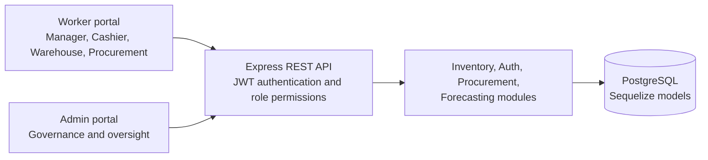

# SyncStock 2.0

SyncStock is a cloud-native inventory and access-management system for retail and warehouse operations. It combines a role-based operations portal with a separately authenticated administration portal, an Express API, and PostgreSQL persistence.

The repository also contains the project demonstration notes and design documents. The application source and its detailed setup/API guide are in [`Code/`](Code/) and [`Code/README.md`](Code/README.md).

## What the System Does

SyncStock tracks products, stock levels, suppliers, purchasing, sales, returns, and online-order reservations. Stock changes are recorded as movements, while managers get operational and demand-forecasting views. Administrators govern employee accounts and warehouse facilities without inheriting operational permissions.

### Workspaces and Roles

| Role | Main responsibilities |
| --- | --- |
| **Administrator** | Provision and deactivate employees, reset passwords and MFA, manage warehouses, review security logs, and view operational data. |
| **Manager** | Review KPIs and forecasts, manage the catalogue, oversee sales and returns, and approve or send purchase orders. |
| **Cashier** | Find items by SKU or barcode, complete multi-item sales, issue receipts, and process receipt-based returns. |
| **Warehouse staff** | Receive purchase orders, adjust stock, reconcile cycle counts, and fulfill or release reserved online orders. |
| **Procurement staff** | Manage suppliers and create purchase orders, including replenishment for low-stock products. |

The administrator role is deliberately separate from the worker permission hierarchy. The two portals also use separate browser session-token namespaces.

### Main Workflows

- **Point of sale:** Validate available stock, apply discounts, calculate South African VAT at 15%, complete payment, and create a receipt and stock movement.
- **Returns:** Look up the original sale by receipt, record a structured return reason, and restore the returned quantity to stock.
- **Replenishment:** Forecast demand and stockout risk, create a draft purchase order, approve and send it, then record full or partial deliveries.
- **Warehouse control:** Record receiving and adjustments, compare counted quantities with system quantities, and retain a record of discrepancies.
- **Online fulfillment:** Reserve stock for an order, then commit the reservation when fulfilled or release it when cancelled.
- **Administration:** Maintain staff and warehouse records, enforce password and MFA resets, and review security events.

## Architecture


```mermaid
flowchart LR
	Worker[Worker portal<br/>Manager, Cashier, Warehouse, Procurement]
	Admin[Admin portal<br/>Governance and oversight]
	API[Express REST API<br/>JWT authentication and role permissions]
	Domain[Inventory, Auth, Procurement,<br/>Forecasting modules]
	DB[(PostgreSQL<br/>Sequelize models)]

	Worker --> API
	Admin --> API
	API --> Domain
	Domain --> DB
```

The frontend is a React multi-page Vite application. `index.html` is the worker portal entry point and `admin.html` is the administration portal entry point. The backend is a TypeScript Express service; domain modules handle inventory transactions, authentication, procurement, and forecasting, while Sequelize models persist the operational records to PostgreSQL.

### Data and Security

The data model includes users and roles, products and categories, warehouses, suppliers, purchase orders, stock movements, sales and sale items, online orders and reservations, and security audit records. Catalogue data is hydrated during backend startup so inventory state can be restored from persistence.

Authentication supports email or employee-ID login, bcrypt password hashes, first-login password setup, JWT sessions, optional email verification codes, and TOTP multi-factor authentication. Authorization is enforced by role at the API. SMTP is optional for email delivery; local credentials and secrets belong in `Code/backend/.env`, never in commits.

## Technology

- **Frontend:** React 18, Vite, JavaScript/JSX, CSS custom properties, light and dark themes.
- **Backend:** Node.js, Express 4, TypeScript, REST endpoints.
- **Persistence:** PostgreSQL 16 and Sequelize 6.
- **Authentication:** JSON Web Tokens, bcryptjs, TOTP via otplib, and optional email via Nodemailer.
- **Tests:** Node.js native test runner with inventory, authentication, procurement, forecasting, and API tests.

## Repository Layout

```text
.
├── Code/                 Application source, package workspaces, and detailed guide
│   ├── backend/          Express API, domain modules, models, and tests
│   ├── frontend/         Worker and admin portals
│   ├── docker-compose.yml
│   └── README.md         Detailed feature, API, and configuration reference
├── Demo/                 Demonstration notes
├── Documents/            Project problem statement and design/planning documents
├── Group Names.txt
└── Implementation Roadmap.md
```

## Run Locally

Requirements: Node.js 18 or later, npm, and either Docker Desktop or a local PostgreSQL server.

From PowerShell at the repository root:

```powershell
Set-Location Code
npm.cmd install
Copy-Item backend\.env.example backend\.env
docker compose up -d
npm.cmd run dev
```

Review `backend\.env` and configure database or optional email settings for your environment. Do not commit it. The development servers are available at:

| Service | URL |
| --- | --- |
| Worker portal | `http://localhost:5175/` |
| Admin portal | `http://localhost:5175/admin.html` |
| Backend health check | `http://localhost:4000/api/health` |

Docker Compose starts PostgreSQL and Redis. Redis is included in the local infrastructure configuration; the application persists its domain data in PostgreSQL.

## Tests and Production Build

Run the backend test suite and build both workspaces from `Code/`:

```powershell
npm.cmd test --workspace backend
npm.cmd run build
```

Tests use the Node.js test runner and cover inventory calculations and transactions, authentication and permissions, forecasting, procurement state transitions, and API behavior. The build compiles the TypeScript backend and creates the multi-page frontend bundle.

## API Overview

The API is served from `http://localhost:4000`. Authenticated routes use a bearer token; role permissions vary by endpoint.

| Area | Representative endpoints | Purpose |
| --- | --- | --- |
| Health and authentication | `GET /api/health`, `POST /api/auth/login` | Service status, login, and account setup. |
| Inventory | `GET /api/inventory/workspace` | Role-scoped catalogue and stock information. |
| Sales and returns | `POST /api/sales`, `POST /api/returns` | Checkout and receipt-based returns. |
| Purchasing | `/api/purchase-orders` | Create, approve, send, receive, or cancel purchase orders. |
| Forecasting and suppliers | `/api/forecast`, `/api/suppliers` | Demand risk, replenishment guidance, and supplier performance. |
| Online orders | `/api/orders` | Reserve, commit, or release inventory reservations. |
| Cycle counts | `/api/cycle-counts` | Submit counts and reconcile discrepancies. |
| Administration | `/api/admin/*` | Employee, warehouse, audit-log, and read-only oversight operations. |

See the [detailed application guide](Code/README.md) for the complete endpoint list, request flows, environment-variable reference, and feature details.

## Project Documents

- [`Documents/PROJECT PROBLEM STATEMEN1.docx`](Documents/PROJECT%20PROBLEM%20STATEMEN1.docx) describes the project problem.
- [`Documents/System Design Specification.docx`](Documents/System%20Design%20Specification.docx) describes the proposed system design.
- [`Documents/Inventory System Development Plan.docx`](Documents/Inventory%20System%20Development%20Plan.docx) and [`Implementation Roadmap.md`](Implementation%20Roadmap.md) describe planning and delivery.
