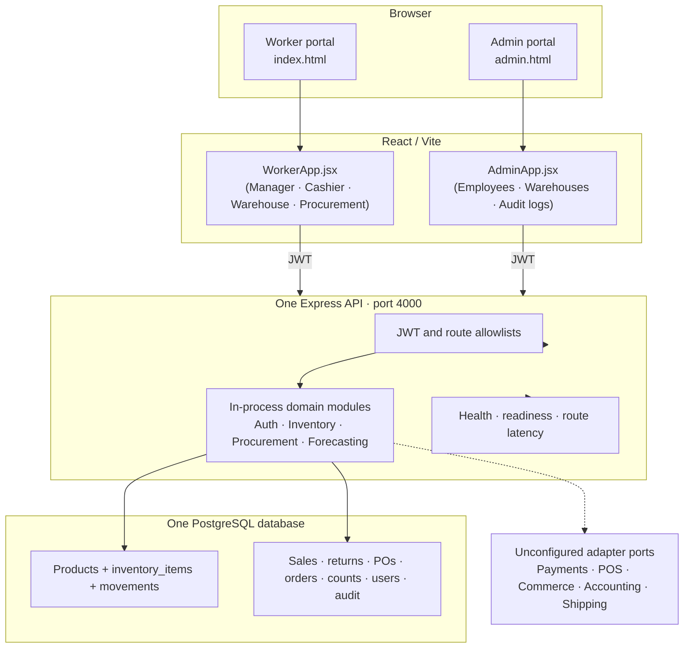
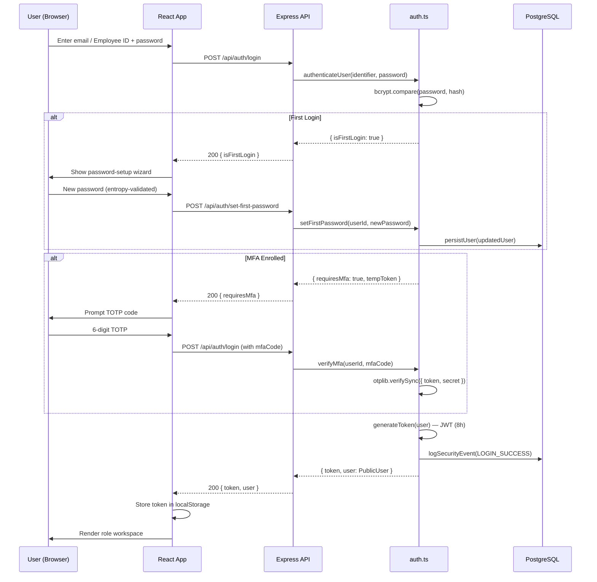
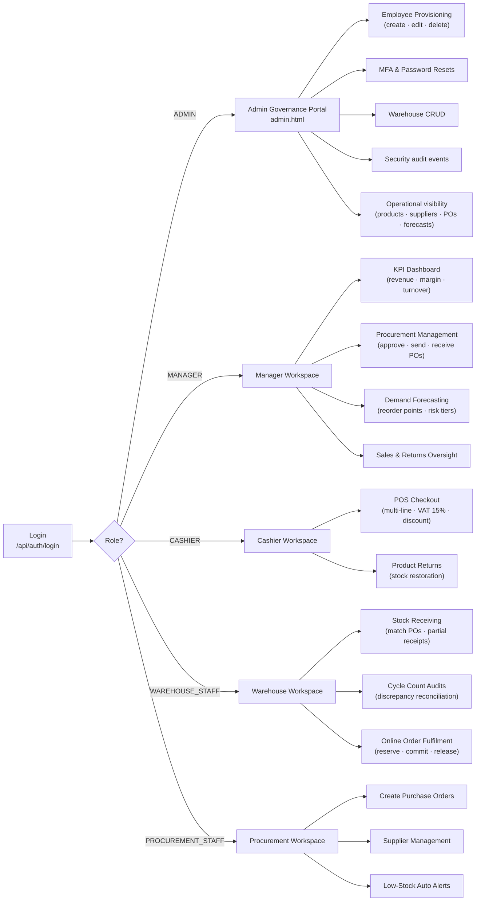
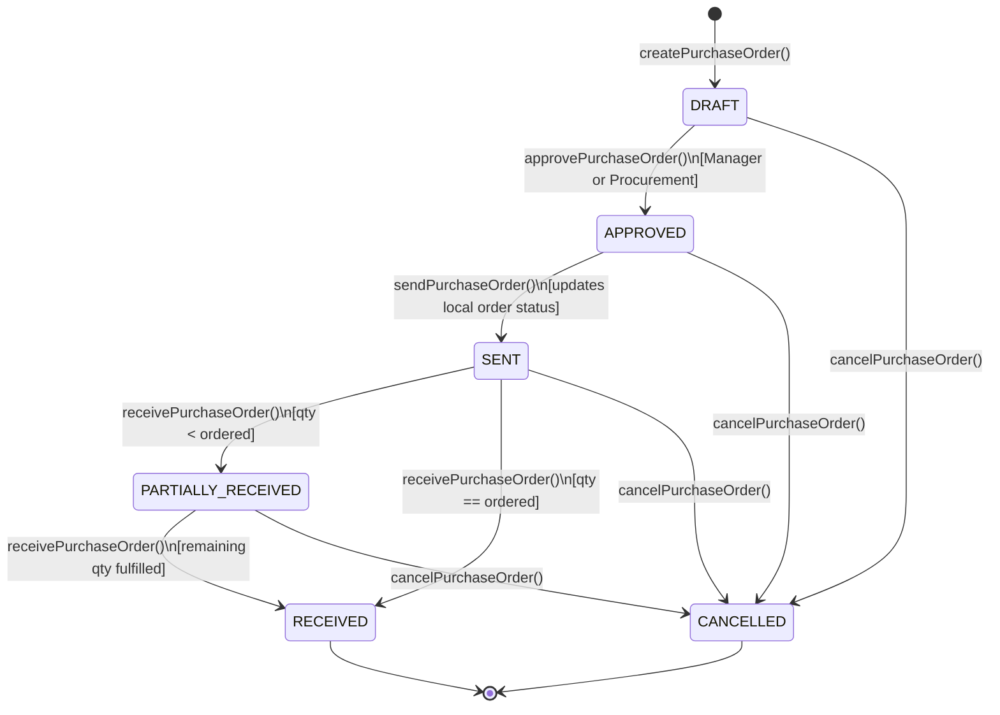
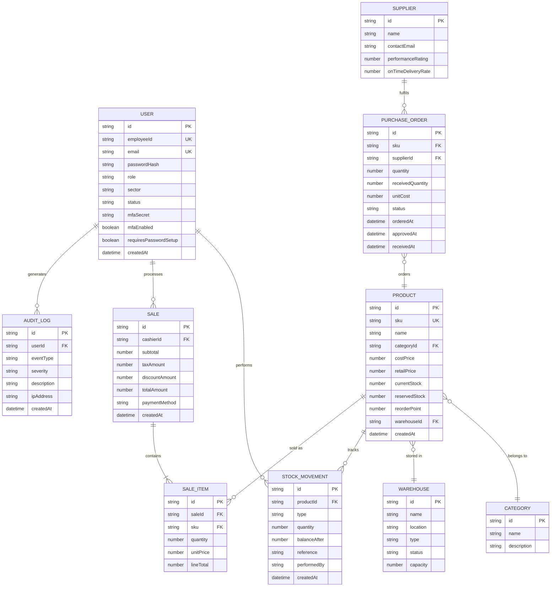

# SyncStock 2.0 — Inventory & Access Management Prototype

> **A dual-portal inventory operations prototype** built with Node.js · Express · TypeScript · React 18 · Vite · PostgreSQL.

SyncStock 2.0 provides dedicated workspaces for each operational role in a retail/logistics organisation: point-of-sale cashiers, stock-floor managers, warehouse receiving staff, procurement officers, and a completely separate administrative governance console for HR and facility management.

---

## Table of Contents

1. [Key Highlights](#key-highlights)
2. [Deployment Status](#deployment-status)
3. [Implemented Scope and Design Status](#implemented-scope-and-design-status)
4. [Current Runtime Architecture](#current-runtime-architecture)
5. [Authentication & Security Flow](#authentication--security-flow)
6. [Role Workspaces](#role-workspaces)
7. [Purchase Order Lifecycle](#purchase-order-lifecycle)
8. [Proposed Data Model](#proposed-data-model-er-diagram)
9. [Target Role Access Matrix](#target-role-access-matrix)
10. [Feature Deep-Dive](#feature-deep-dive)
11. [Technology Stack](#technology-stack)
12. [Repository Structure](#repository-structure)
13. [Quick Start](#quick-start)
14. [Demo Access](#demo-access)
15. [API Reference](#api-reference)
16. [Testing & Quality Assurance](#testing--quality-assurance)
17. [Environment Variables](#environment-variables)
18. [Production Build](#production-build)
19. [Project Documents](#project-documents)


## Key Highlights

| Feature | Detail |
| :--- | :--- |
| **Dual-Portal Architecture** | Worker Operations Portal + Admin Governance Console — completely separated HTML entry points and JWT namespaces |
| **Role-based portals** | Five roles with endpoint-level allowlists; actual permissions are documented below |
| **Real TOTP MFA** | RFC 6238 Time-based OTP via `otplib` — QR URI generation, enrollment, and verification |
| **PostgreSQL Persistence** | Sequelize ORM; bin stock, users, sales, movements, orders, purchase orders, and cycle counts hydrate on startup |
| **Demand Forecasting** | Linear regression over daily stock movements, with sparse-history fallbacks and injectable seasonality/promotion factors |
| **Payment Safety** | Cash tender is validated; Card/QR and electronic refunds fail closed without a provider authorization |
| **Operational Signals** | Liveness/readiness endpoints and in-memory per-route average/p95 latency metrics |
| **Automated Test Coverage** | Native Node.js tests across inventory, auth, procurement, forecasting, integration ports, and metrics |
| **Professional Brand Identity** | Dual-variant SVG vector logo (`BrandLogo.jsx`) — inventory cube (worker) / shield crest (admin) |
| **Dark Mode** | Full light/dark design system via CSS custom properties |

---

## Deployment Status

SyncStock is deployed as a single-instance demo on AWS EC2 in the Europe (Stockholm) region. On 2026-10-08, the worker portal and API readiness endpoint were verified over HTTP at `13.63.238.187`. This is a single-server demo, not a highly available production deployment. The deployed application source is now maintained in the root `Code/` directory.

| Service | Current address / status |
| :--- | :--- |
| Worker Operations Portal | [http://13.63.238.187](http://13.63.238.187) |
| Admin Governance Portal | [http://13.63.238.187/admin.html](http://13.63.238.187/admin.html) |
| API readiness check | [http://13.63.238.187/api/health/ready](http://13.63.238.187/api/health/ready) |
| PostgreSQL | Running locally on the EC2 instance |
| Email delivery | SMTP settings are deployment-specific; verify end-to-end delivery before relying on it |
| HTTPS | Not enabled yet; a hostname that resolves to the instance is required before a trusted certificate can be issued |

> [!CAUTION]
> The hosted site currently uses **HTTP**, which does not encrypt traffic between the browser and server. Do not enter real passwords or sensitive business data until HTTPS is enabled. The IP address may change if the EC2 instance is stopped and started unless an Elastic IP is assigned. This is a small single-server deployment, not a highly available production architecture.

To enable HTTPS, configure a hostname you control to resolve to the EC2 public IP, allow inbound TCP port 443 in the instance security group, and issue a certificate (for example, with Let's Encrypt and Certbot). Do not request a certificate until public DNS resolves correctly.

Deployment notes report SMTP relay authentication configured on the EC2 host; end-to-end delivery still needs verification after deployment changes. Keep SMTP credentials in the server's environment file or a secrets manager; never commit them to the repository.

## Implemented Scope and Design Status

| Area | Implemented in the current code | Not delivered / limitation |
| :--- | :--- | :--- |
| Application | React/Vite worker and Admin portals; one TypeScript/Express API with in-process domain modules | Not independently deployed microservices; no API gateway, broker, database-per-service, or distributed saga |
| Inventory | Product catalogue, bin-level inventory records, aggregate available/reserved totals, sales, returns, movements, receiving, counts, and reservations | No bin transfer workflow, database-enforced foreign keys, or multi-instance concurrency/locking strategy |
| Persistence | PostgreSQL/Sequelize tables and startup hydration for major operational state | Development/test can use in-memory mode; return history and some seeded/reference collections are not fully restored |
| Forecasting | Regression-based demand trend over up to 730 daily buckets; sparse-history fallback and context multipliers | No configured promotion/seasonal feed, trained deep-learning model, or measured forecast accuracy |
| Payments/integrations | Payment provider contract validates full authorization; integrations have provider-neutral contracts | No live payment, POS, commerce, accounting, or shipping provider is configured. Card/QR and electronic refunds are unavailable until one is registered |
| Operations | Health/readiness checks and in-memory request latency/error metrics | No verified latency/uptime SLOs, HA, backup/replication plan, CI/CD, centralized monitoring, Kubernetes, or infrastructure-as-code |

The accompanying project specifications describe a broader target architecture. They are design goals, not evidence that these capabilities are deployed in this prototype.

---

## Current Runtime Architecture


```mermaid
flowchart TD
    subgraph Browser["Browser"]
        WP["Worker portal\nindex.html"]
        AP["Admin portal\nadmin.html"]
    end

    subgraph Frontend["React / Vite"]
        WA["WorkerApp.jsx\n(Manager · Cashier · Warehouse · Procurement)"]
        AA["AdminApp.jsx\n(Employees · Warehouses · Audit logs)"]
    end

    subgraph API["One Express API · port 4000"]
        AUTH["JWT and route allowlists"]
        MODULES["In-process domain modules\nAuth · Inventory · Procurement · Forecasting"]
        METRICS["Health · readiness · route latency"]
    end

    subgraph DB["One PostgreSQL database"]
        STOCK["Products + inventory_items + movements"]
        TRANSACTIONS["Sales · returns · POs · orders · counts · users · audit"]
    end

    PORTS["Unconfigured adapter ports\nPayments · POS · Commerce · Accounting · Shipping"]

    WP --> WA
    AP --> AA
    WA -->|JWT| API
    AA -->|JWT| API
    API --> AUTH --> MODULES
    MODULES --> STOCK
    MODULES --> TRANSACTIONS
    MODULES -.-> PORTS
    API --> METRICS
```

The current application is a modular monolith: one Express process, in-process domain modules, and one PostgreSQL database. Redis is present in Compose but is not used by application code. There is no API gateway, independent service deployment, database-per-service, message broker, or distributed saga.

---

## Authentication & Security Flow


```mermaid
sequenceDiagram
    participant U as User (Browser)
    participant FE as React App
    participant API as Express API
    participant AUTH as auth.ts
    participant DB as PostgreSQL

    U->>FE: Enter email / Employee ID + password
    FE->>API: POST /api/auth/login
    API->>AUTH: authenticateUser(identifier, password)
    AUTH->>AUTH: bcrypt.compare(password, hash)
    alt First Login
        AUTH-->>API: { isFirstLogin: true }
        API-->>FE: 200 { isFirstLogin }
        FE->>U: Show password-setup wizard
        U->>FE: New password (entropy-validated)
        FE->>API: POST /api/auth/set-first-password
        API->>AUTH: setFirstPassword(userId, newPassword)
        AUTH->>DB: persistUser(updatedUser)
    end
    alt MFA Enrolled
        AUTH-->>API: { requiresMfa: true, tempToken }
        API-->>FE: 200 { requiresMfa }
        FE->>U: Prompt TOTP code
        U->>FE: 6-digit TOTP
        FE->>API: POST /api/auth/login (with mfaCode)
        API->>AUTH: verifyMfa(userId, mfaCode)
        AUTH->>AUTH: otplib.verifySync({ token, secret })
    end
    AUTH->>AUTH: generateToken(user) — JWT (8h)
    AUTH->>DB: logSecurityEvent(LOGIN_SUCCESS)
    AUTH-->>API: { token, user: PublicUser }
    API-->>FE: 200 { token, user }
    FE->>FE: Store token in localStorage
    FE->>U: Render role workspace
```

> [!CAUTION]
> The demo administrator password is seeded in source for local fallback use. Development/test fallback stores seeded passwords in plaintext; email OTP codes are written to logs; tokens are stored in `localStorage`; CORS is permissive; and `/api/auth/quick-switch` is unauthenticated. This prototype is not suitable for real user data without replacing demo credentials, removing demo switching, tightening CORS, and enabling HTTPS.

---

## Role Workspaces


```mermaid
flowchart LR
    LOGIN["Login\n/api/auth/login"] --> ROLE{Role?}

    ROLE -->|ADMIN| ADMIN_WS["Admin Governance Portal\nadmin.html"]
    ROLE -->|MANAGER| MGR_WS["Manager Workspace"]
    ROLE -->|CASHIER| CSH_WS["Cashier Workspace"]
    ROLE -->|WAREHOUSE_STAFF| WRH_WS["Warehouse Workspace"]
    ROLE -->|PROCUREMENT_STAFF| PRC_WS["Procurement Workspace"]

    ADMIN_WS --> A1["Employee Provisioning\n(create · edit · delete)"]
    ADMIN_WS --> A2["MFA & Password Resets"]
    ADMIN_WS --> A3["Warehouse CRUD"]
    ADMIN_WS --> A4["Security audit events"]
    ADMIN_WS --> A5["Operational visibility\n(products · suppliers · POs · forecasts)"]

    MGR_WS --> M1["KPI Dashboard\n(revenue · margin · turnover)"]
    MGR_WS --> M2["Procurement Management\n(approve · send · receive POs)"]
    MGR_WS --> M3["Demand Forecasting\n(reorder points · risk tiers)"]
    MGR_WS --> M4["Sales & Returns Oversight"]

    CSH_WS --> C1["POS Checkout\n(multi-line · VAT 15% · discount)"]
    CSH_WS --> C2["Product Returns\n(stock restoration)"]

    WRH_WS --> W1["Stock Receiving\n(match POs · partial receipts)"]
    WRH_WS --> W2["Cycle Count Audits\n(discrepancy reconciliation)"]
    WRH_WS --> W3["Online Order Fulfilment\n(reserve · commit · release)"]

    PRC_WS --> P1["Create Purchase Orders"]
    PRC_WS --> P2["Supplier Management"]
    PRC_WS --> P3["Low-Stock Auto Alerts"]
```

---

## Purchase Order Lifecycle


```mermaid
stateDiagram-v2
    [*] --> DRAFT: createPurchaseOrder()

    DRAFT --> APPROVED: approvePurchaseOrder()\n[Manager or Procurement]
    DRAFT --> CANCELLED: cancelPurchaseOrder()

    APPROVED --> SENT: sendPurchaseOrder()\n[updates local order status]
    APPROVED --> CANCELLED: cancelPurchaseOrder()

    SENT --> PARTIALLY_RECEIVED: receivePurchaseOrder()\n[qty < ordered]
    SENT --> RECEIVED: receivePurchaseOrder()\n[qty == ordered]
    SENT --> CANCELLED: cancelPurchaseOrder()

    PARTIALLY_RECEIVED --> RECEIVED: receivePurchaseOrder()\n[remaining qty fulfilled]
    PARTIALLY_RECEIVED --> CANCELLED: cancelPurchaseOrder()

    RECEIVED --> [*]
    CANCELLED --> [*]
```

---

## Proposed Data Model (ER Diagram)

> This diagram is the logical design proposal from the project specification, not the physical schema currently used by Sequelize. The implemented tables and multi-bin inventory model are documented in [Code/README.md](Code/README.md).


```mermaid
erDiagram
    USER {
        string id PK
        string employeeId UK
        string email UK
        string passwordHash
        string role
        string sector
        string status
        string mfaSecret
        boolean mfaEnabled
        boolean requiresPasswordSetup
        datetime createdAt
    }
    PRODUCT {
        string id PK
        string sku UK
        string name
        string categoryId FK
        number costPrice
        number retailPrice
        number currentStock
        number reservedStock
        number reorderPoint
        string warehouseId FK
        datetime createdAt
    }
    CATEGORY {
        string id PK
        string name
        string description
    }
    WAREHOUSE {
        string id PK
        string name
        string location
        string type
        string status
        number capacity
    }
    SUPPLIER {
        string id PK
        string name
        string contactEmail
        number performanceRating
        number onTimeDeliveryRate
    }
    PURCHASE_ORDER {
        string id PK
        string sku FK
        string supplierId FK
        number quantity
        number receivedQuantity
        number unitCost
        string status
        datetime orderedAt
        datetime approvedAt
        datetime receivedAt
    }
    STOCK_MOVEMENT {
        string id PK
        string productId FK
        string type
        number quantity
        number balanceAfter
        string reference
        string performedBy
        datetime createdAt
    }
    SALE {
        string id PK
        string cashierId FK
        number subtotal
        number taxAmount
        number discountAmount
        number totalAmount
        string paymentMethod
        datetime createdAt
    }
    SALE_ITEM {
        string id PK
        string saleId FK
        string sku FK
        number quantity
        number unitPrice
        number lineTotal
    }
    AUDIT_LOG {
        string id PK
        string userId FK
        string eventType
        string severity
        string description
        string ipAddress
        datetime createdAt
    }

    USER ||--o{ STOCK_MOVEMENT : "performs"
    USER ||--o{ SALE : "processes"
    USER ||--o{ AUDIT_LOG : "generates"
    PRODUCT }o--|| CATEGORY : "belongs to"
    PRODUCT }o--|| WAREHOUSE : "stored in"
    PRODUCT ||--o{ STOCK_MOVEMENT : "tracks"
    PRODUCT ||--o{ SALE_ITEM : "sold as"
    SUPPLIER ||--o{ PURCHASE_ORDER : "fulfils"
    PURCHASE_ORDER }o--|| PRODUCT : "orders"
    SALE ||--|{ SALE_ITEM : "contains"
```

---

## Target Role Access Matrix

> This matrix describes the original governance target. Current endpoint allowlists differ in several places; use the [implemented API access matrix](Code/README.md#current-api-access-matrix) when checking the running code.

| Capability | Admin | Manager | Cashier | Warehouse | Procurement |
| :--- | :---: | :---: | :---: | :---: | :---: |
| Employee provisioning & deletion | ✅ | ❌ | ❌ | ❌ | ❌ |
| Password & MFA resets | ✅ | ❌ | ❌ | ❌ | ❌ |
| Warehouse CRUD | ✅ | ❌ | ❌ | ❌ | ❌ |
| Security audit log access | ✅ | ❌ | ❌ | ❌ | ❌ |
| Product catalogue read | ✅ | ✅ | ✅ | ✅ | ✅ |
| POS checkout | ❌ | ✅ | ✅ | ❌ | ❌ |
| Product returns | ❌ | ✅ | ✅ | ❌ | ❌ |
| Approve purchase orders | ❌ | ✅ | ❌ | ❌ | ❌ |
| Create purchase orders | ❌ | ✅ | ❌ | ❌ | ✅ |
| Stock receiving (warehouse) | ❌ | ❌ | ❌ | ✅ | ❌ |
| Cycle count audits | ❌ | ❌ | ❌ | ✅ | ❌ |
| Online order reservation | ❌ | ✅ | ❌ | ✅ | ❌ |
| Demand forecasting view | ❌ | ✅ | ❌ | ❌ | ✅ |
| KPI dashboard | ❌ | ✅ | ❌ | ❌ | ❌ |

> [!NOTE]
> Admin is intentionally isolated from the operational permission hierarchy. `hasPermission('ADMIN', 'MANAGER')` returns `false` by design — Admin governs people and facilities, not merchandise transactions.

---

## Feature Deep-Dive

### 🛒 Cashier Workspace

| Feature | Detail |
| :--- | :--- |
| **Barcode / SKU scanner** | Input field accepts physical scanner output or manual entry; matches by barcode string or SKU (case-insensitive) and adds item to cart instantly |
| **Live stock guard** | Adding or incrementing an item beyond its available stock triggers a real-time error — the cart cannot exceed what is physically on hand |
| **Tender & change calculation** | Cash tender amount input; change-due auto-calculated and displayed before checkout confirmation |
| **Payment methods** | Cash is validated against the total; Card/QR require a configured provider authorization. No provider is configured by default, so electronic checkout fails closed |
| **South African VAT (15%)** | VAT is extracted from the inclusive price using the formula `total × 15 / 115`, not added on top — correct for SA tax law |
| **Percentage discount** | Discount slider/input applied before VAT extraction; supports 0–100% |
| **Printed receipt** | On successful sale, a formatted receipt is generated in-app with receipt number, line items, VAT breakdown, payment method, cashier ID, and timestamp |
| **Receipt-based returns** | Cashier enters receipt number to look up the original sale; system pre-fills the product, and upon confirmation restores stock and logs a refund movement |
| **Return reason codes** | Structured reason picker: Damaged Product, Expired Item, Defective Goods, Wrong Item/Size, Customer Changed Mind, Packaging Compromised |
| **Receipts history tab** | Third tab shows a paginated list of past sale receipts for the current session |
| **Category filter** | Product grid can be filtered by category tab to speed up item lookup |

---

### 📊 Manager Workspace

| Feature | Detail |
| :--- | :--- |
| **KPI Dashboard** | Live tiles: daily sales revenue, stock-on-hand count, available vs reserved units, inventory cost value, inventory retail value, gross margin %, low-stock count |
| **Product catalogue management** | Managers can create new products and edit existing ones via a full product form (SKU, barcode, name, category, supplier, cost price, retail price, reorder point, reorder quantity, warehouse, bin location, image URL) |
| **Catalogue search & filter** | Full-text search by product name, SKU, or barcode; combined with category tab filter |
| **One-click replenishment PO** | A high-risk SKU can prefill a draft PO using supplier, available stock, and configured reorder quantity; this is not an EOQ calculation |
| **Bulk low-stock PO generation** | Single button generates draft purchase orders for all SKUs currently below reorder point — skips any SKU that already has an open draft PO |
| **Supplier performance ratings** | Supplier list shows on-time delivery rate and quality score alongside contact details |
| **Purchase order approval flow** | Manager and Procurement API roles can approve (DRAFT → APPROVED), send (APPROVED → SENT), or cancel open orders |
| **Forecasting sub-tabs** | Workspace has four tabs: Overview (KPIs), Forecasting (risk table), Suppliers, and Catalogue |

---

### 🏭 Warehouse Workspace

| Feature | Detail |
| :--- | :--- |
| **Goods receiving** | Operator selects an open PO and enters quantity and destination warehouse/bin. The displayed condition and notes fields are not currently sent to the API |
| **Partial receipt support** | If received quantity is less than ordered, PO status moves to PARTIALLY_RECEIVED; remaining quantity is tracked for follow-up receipts |
| **Cycle count auditing** | Warehouse/bin selector; submission reconciles only the selected bin and stores a cycle-count record plus stock movement. Database-level immutability is not enforced |
| **Stock adjustment** | The UI offers ADD/REMOVE controls, but both currently submit to the receiving endpoint, which adds stock. REMOVE and bin transfer are not implemented |
| **Online order fulfilment** | Committing a reservation deducts physical stock and changes the order to `PAID`; releasing it restores availability |
| **Mobile scanner simulation mode** | Toggle switches the UI into a compact, touch-friendly scanner simulation layout suited for handheld devices |
| **Four workspace tabs** | Receiving, Cycle Count, Stock Adjustments, Order Fulfilment |

---

### 🔐 Admin Governance Portal

| Feature | Detail |
| :--- | :--- |
| **Employee registration modal** | Full form: name, email, sector (Store Management / Cashier & Front-of-House / Warehouse & Logistics / Procurement & Supply Chain / System Administration), role, temporary password |
| **Employee search & sector filter** | Search by name/email combined with sector dropdown filter |
| **Inline employee edit** | Click Edit on any employee row to update their name, email, sector, role, or status in-place |
| **Force password reset** | One-click action sets `isFirstLogin` and a temporary password — the employee must choose a new password on next login |
| **MFA revocation** | Admin can revoke an employee's TOTP secret; they can re-enroll on next login |
| **Account removal** | Delete removes the employee row; it is not a soft-delete. Use status updates when retaining the account is required |
| **Security audit log** | Security events use insert-only application writes and are displayed with actor, details, status, and time. Direct SQL updates/deletes are not prevented; IP is currently a loopback placeholder |
| **Warehouse facility management** | Create, edit, and delete warehouse records with ID, name, city, bin count, active SKUs, capacity %, supervisor assignment, and operational status (OPERATIONAL / STANDBY / MAINTENANCE) |
| **Operational oversight** | Admin can view operations; current API allowlists also permit Admin product create/update. See the implementation access notes |
| **Policies tab** | Displays the system's access control and security policies in human-readable format |
| **Session expiry detection** | On any 401 response, the portal auto-clears the session and returns to the login screen |

---

### 🔑 Authentication System

| Feature | Detail |
| :--- | :--- |
| **Dual-identifier login** | Accepts email address, Employee ID (`EMP-XXX-NNN`), or generic `identifier` field — any format works |
| **First-login password wizard** | New accounts use the `isFirstLogin` flag; a wizard enforces password-strength rules |
| **Password strength rules** | Minimum 8 characters, at least one uppercase, one lowercase, one digit, one symbol — validated client and server side |
| **Email OTP verification** | A 6-digit code can be sent using optional SMTP and expires after 10 minutes. Codes are also written to backend logs; outstanding codes are in process memory |
| **TOTP MFA enrollment** | On enrollment, server generates a random secret, returns a QR-compatible URI (`otpauth://`), and the user scans it with any authenticator app |
| **TOTP verification** | Every login with MFA enrolled requires a valid 6-digit TOTP code (30-second window, RFC 6238) verified server-side with `otplib` |
| **JWT session tokens** | 8-hour expiry; signed with `JWT_SECRET`; browser tokens are stored in `localStorage` |
| **Separate JWT namespaces** | Worker portal stores token in `syncstock_worker_token`; Admin portal in `syncstock_admin_token` — cross-portal token reuse is rejected |

---


## Technology Stack

| Layer | Technology | Version |
| :--- | :--- | :--- |
| **Frontend Runtime** | React | 18 |
| **Frontend Build** | Vite (multi-page) | 5 |
| **UI Styling** | Modern CSS custom properties (light/dark) | — |
| **Backend Runtime** | Node.js | v24 |
| **Backend Framework** | Express | 4 |
| **Backend Language** | TypeScript | 5 |
| **Database** | PostgreSQL | 16 |
| **ORM** | Sequelize | 6 |
| **Regression model** | `ml-regression` | 6 |
| **Authentication** | JWT (`jsonwebtoken`) | — |
| **Password Hashing** | bcryptjs | — |
| **TOTP MFA** | otplib | — |
| **Email OTP** | nodemailer | — |
| **Testing** | Node.js native test runner | v24 built-in |

---

## Repository Structure

```text
.
├── Code/                      # Application source and detailed implementation guide
│   ├── backend/               # Express API, domain modules, Sequelize models, tests
│   ├── frontend/              # Worker and admin React portals
│   ├── docker-compose.yml     # Local PostgreSQL and Redis containers
│   ├── package.json           # npm workspace scripts
│   └── README.md              # Detailed features, routes, schema, and setup
├── Demo/                      # Demonstration notes
├── Documents/                 # Academic problem/design/development documents
├── Group Names.txt
├── Implementation Roadmap.md
└── README.md                  # Repository overview and deployment status
```

---

## Quick Start

### 1. Prerequisites

- **Node.js**: v18 or later (tested on v24)
- **Docker Desktop** for the local PostgreSQL service, or an accessible PostgreSQL server.

```powershell
Set-Location Code
npm.cmd install
Copy-Item backend\.env.example backend\.env
docker compose up -d
```

For the local Compose database, configure `backend\.env` with `DB_HOST=localhost`, `DB_PORT=5432`, `DB_USER=postgres`, `DB_PASSWORD=postgres`, `DB_NAME=inventory_db`, and a unique `JWT_SECRET`.

### Start the App

```powershell
npm.cmd run dev
```

Both the backend API and the Vite dev server start concurrently:

| Service | URL |
| :--- | :--- |
| Backend API | `http://localhost:4000` |
| Worker Operations Portal | `http://localhost:5175` |
| Admin Governance Portal | `http://localhost:5175/admin.html` |
| Health Check | `http://localhost:4000/api/health` |

> [!TIP]
> On Windows PowerShell, always use `npm.cmd` instead of `npm` to ensure npm scripts execute correctly.

---

## Demo Access

### System Administrator

> [!CAUTION]
> Do not publish or reuse administrator credentials. The application does not read `ADMIN_EMAIL` or `ADMIN_PASSWORD` environment variables; use the administrator account and password flow supported by the application, then change any initial password immediately.

| Field | Value |
| :--- | :--- |
| Email | *(use the administrator account configured for the application)* |
| Employee ID | `EMP-ADM-001` |
| Password | *(do not store credentials in this README)* |
| Portal | `http://localhost:5175/admin.html` |

The Administrator can create all other staff accounts (Managers, Cashiers, Warehouse Staff, Procurement Officers) directly within the Admin Portal. Each account receives a sector-prefixed Employee ID automatically:

| Role | Employee ID Prefix | Example |
| :--- | :--- | :--- |
| Administrator | `EMP-ADM-` | `EMP-ADM-001` |
| Manager | `EMP-MGR-` | `EMP-MGR-001` |
| Cashier | `EMP-CSH-` | `EMP-CSH-001` |
| Warehouse Staff | `EMP-WRH-` | `EMP-WRH-001` |
| Procurement Staff | `EMP-PRC-` | `EMP-PRC-001` |

---

## API Reference

All routes are served by the Express API on port `4000`. Bearer JWT authentication is required except for liveness/readiness, demo-account listing, login, and verification flows. Access varies per endpoint.

| Area | Representative routes | Purpose |
| :--- | :--- | :--- |
| Health/metrics | `GET /api/health`, `GET /api/health/ready`, `GET /api/admin/metrics` | Liveness, readiness, and admin route-latency metrics |
| Authentication/admin | `/api/auth/*`, `/api/admin/employees/*`, `/api/admin/warehouses/*`, `/api/admin/audit-logs` | Login, first password, TOTP/email verification, staff and warehouse administration |
| Inventory | `/api/products`, `/api/stock-movements`, `/api/inventory/workspace`, `/api/inventory/items` | Catalogue, movement history, role data, warehouse/bin balances |
| Sales/returns | `POST /api/sales`, `GET /api/sales/receipts`, `POST /api/returns` | Checkout, receipts, returns; electronic payment needs a configured provider |
| Receiving/counts | `POST /api/receiving`, `/api/cycle-counts` | Bin receiving and cycle-count reconciliation |
| Procurement | `/api/purchase-orders/*`, `/api/suppliers`, `/api/supplier-performance` | Replenishment, approval, dispatch status, receiving and supplier metrics |
| Forecasting | `GET /api/forecast`, `GET /api/forecast/:sku` | Demand and stockout-risk estimates |
| Online orders | `/api/orders`, `/api/orders/reserve`, `/api/orders/:id/commit`, `/api/orders/:id/release` | Reserve, commit, and release stock |

There are no separate `/api/admin/products`, `/api/admin/suppliers`, `/api/admin/purchase-orders`, or `/api/admin/forecast` aliases. Admin uses shared endpoints when allowed. The unauthenticated `/api/auth/quick-switch` route is a demo shortcut and must be removed/restricted before production. The [detailed Code guide](Code/README.md) lists all routes, schema, configuration, and role allowlists.

---

## Testing & Quality Assurance

Run the complete automated test suite:

```powershell
Set-Location Code
npm.cmd run test --workspace backend
```

### Test Suite Summary

| Suite | Coverage areas |
| :--- | :--- |
| **Inventory Core** | Sales (VAT, discount), returns, stock receiving, cycle counts, reservations, valuation metrics, low-stock detection, dashboard KPIs |
| **Procurement** | PO creation, approval, dispatch, partial and full receiving, cancellation, low-stock PO generation, supplier ratings |
| **Forecasting** | Regression training, sparse-history fallback, promotion/seasonality factors, reorder point, and stockout risk |
| **Auth & Security** | Password policy, employee IDs, JWT verification, role permissions, TOTP MFA, and email OTP |
| **Provider contracts** | Default-deny payment authorization/refunds and full-amount validation |
| **Observability** | Per-route request/error counts and average/p95 calculation |

The latest local run on 2026-10-08 passed **59 tests with 0 failures**. Rerun the command above after changing the code.

> [!IMPORTANT]
> Tests run with `NODE_ENV=test` and do not connect to PostgreSQL. `Code/backend/src/server.test.ts` is empty, so API route and database migration behavior are not covered by a committed integration suite. The frontend has no test/lint script; use the production build to verify it.

---

## Environment Variables

Configure `Code/backend/.env` (copy from `Code/backend/.env.example`):

| Variable | Default | Purpose |
| :--- | :--- | :--- |
| `PORT` | `4000` | HTTP port for Express API |
| `NODE_ENV` | `development` | Runtime mode (`development` · `test` · `production`) |
| `DB_HOST` | `localhost` | PostgreSQL host |
| `DB_PORT` | `5432` | PostgreSQL port |
| `DB_USER` | `postgres` | Database user |
| `DB_PASSWORD` | *(set in `Code/backend/.env`)* | Database password |
| `DB_NAME` | `inventory_db` | PostgreSQL schema / database name |
| `JWT_SECRET` | `dev-secret-key` | HMAC-SHA256 signing key for session tokens; set a long, random secret in production |
| `SMTP_HOST` | *(optional)* | SMTP relay for email OTP delivery |
| `SMTP_PORT` | `587` | SMTP relay port |
| `SMTP_SECURE` | `false` | Use implicit TLS for the SMTP connection (`true` or `false`) |
| `SMTP_USER` | *(optional)* | SMTP username |
| `SMTP_PASSWORD` | *(optional)* | SMTP password |
| `SMTP_FROM` | `SMTP_USER` | Sender name and email address |

> [!CAUTION]
> Never commit `Code/backend/.env` to version control. Use `Code/backend/.env.example` as the template — it contains only placeholder values.

> [!IMPORTANT]
> Production must use unique database and JWT secrets. Configure SMTP credentials only on the server (or in a secrets manager). Do not copy production secrets into this repository or share them in issue reports.

---

## Production Build

Compile TypeScript and generate optimised Vite bundles:

```powershell
Set-Location Code
npm.cmd run build
```

Outputs:
- `Code/backend/dist/` — CommonJS bundle (Node.js)
- `Code/frontend/dist/` — Vite multi-page bundle (`index.html` + `admin.html`, chunked JS/CSS)

Start the compiled API with `npm.cmd start` from `Code/` after setting `NODE_ENV=production` and configuring PostgreSQL. Production startup exits if PostgreSQL is unavailable. This repository has no production web server/reverse-proxy configuration, TLS automation, process supervisor definition, database backup/replication plan, or CI/CD deployment workflow. `Code/docker-compose.yml` starts the local database/cache containers only; it does not deploy the application.

---

## Project Documents

- [Detailed application guide](Code/README.md) covers the current schema, all API routes, setup, and implementation caveats.
- [Project problem statement](Documents/PROJECT%20PROBLEM%20STATEMEN1.docx) describes the SME inventory problem and business case.
- [Inventory system development plan](Documents/Inventory%20System%20Development%20Plan.docx) documents planned workflows, requirements, and design iterations.
- [System design specification](Documents/System%20Design%20Specification.docx) describes the proposed data model, architecture, and quality requirements.
- [Implementation roadmap](Implementation%20Roadmap.md) stages the MVP and future expansion work.
- [Demo notes](Demo/Demo.md) link to the project demonstration.

The Word documents include proposed target-state capabilities. Compare them with the implementation/status table above; design requirements are not automatically delivered features.

## License

Academic project — NPRG631. All rights reserved.
